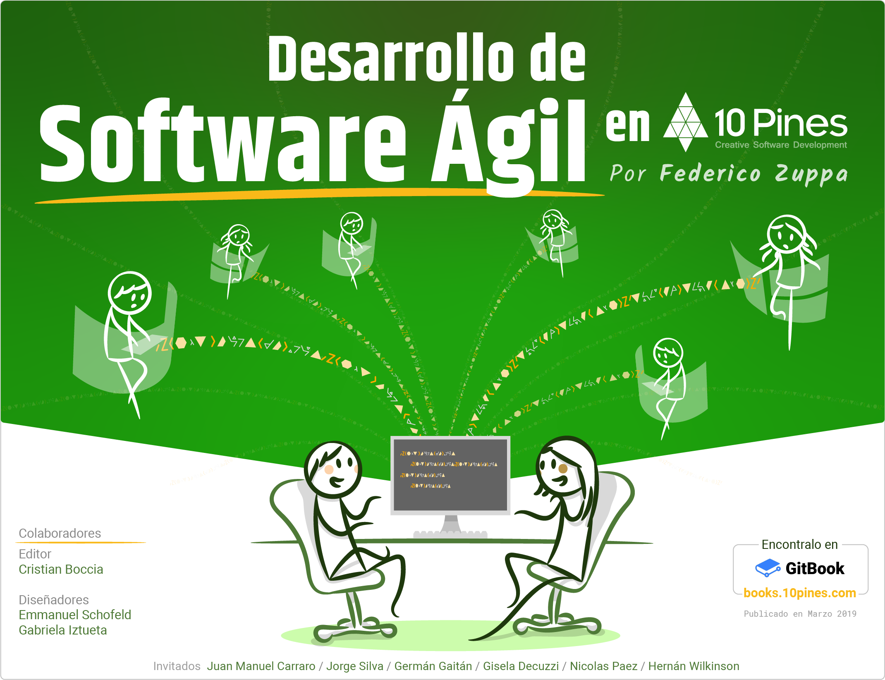

El libro habla sobre agilidad en el contexto del desarrollo de software. Más precisamente, como la vemos e implementamos en 10Pines. De aquí el nombre: Desarrollo de Software Ágil en 10Pines.

Está escrito en orden secuencial, empezando por el *Product Discovery*, siguiendo con el planeamiento para terminar con el desarrollo. Para cada una de estas fases, detallo conceptos, herramientas y prácticas que usamos frecuentemente, indagando sobre sus fundamentos y estableciendo ventajas y desventajas. Comparto opiniones fuertes: El objetivo es pensar y debatir.

Muchas de las secciones contienen colaboraciones de colegas, tanto de 10Pines como del resto de la comunidad ágil. Estos textos enriquecen enormemente el libro.

