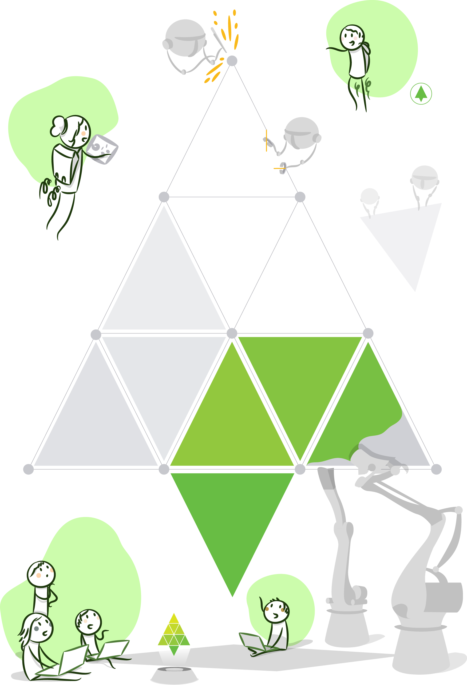

# Desarrollando software, paso a paso

Como ya les comenté en capítulos anteriores, descompusimos nuestro trabajo en incrementos funcionales, que llamamos _user stories_, con el objetivo principal de incorporar a los usuarios de negocios durante la construcción. Metamosnos un poco más ahora en la forma de estos atributos y en el proceso usado para desarrollar cada uno de ellos. En este capítulo describiré el proceso de desarrollo iterativo e incremental. Analizaremos el _rationale_ de las iteraciones fijas y finalizaremos con un recuento de las ventajas de trabajar de este modo.

## Proceso de Desarrollo Iterativo e Incremental

Para los que no sabían \(como yo\), el proceso de desarrollo iterativo e incremental es la combinación de las 2 estrategias, la iterativa y la incremental. ¿Cómo es esto? Algunas de las stories de nuestro backlog son bosquejos, esqueletos no terminados, partes incompletas de funcionalidad, que necesitan trabajo adicional para ser finalizadas. Éstas corresponden a la estrategia iterativa. Otras, son incrementos funcionales completos, listos para ser ser implementados en producción. Éstas corresponden a la estrategia incremental. En nuestro backlog conviven stories que corresponden a las 2 estrategias.  

Empezamos nuestro desarrollo por las user stories que priorizamos en nuestro backlog, que iremos construyendo gradualmente para obtener feedback rápido. Algunas de estas stories, serán bosquejos, esqueletos no terminados, partes incompletas de funcionalidad, que necesitan trabajo adicional para ser finalizadas. Otras, serán incrementos funcionales completos, listos para ser ser implementados en producción. Las primeras, corresponden a la estrategia iterativa. Las segundas a la estrategia incremental. El proceso de desarrollo iterativo e incremental es la combinación de ambas estrategias.  

¿No les quedó muy claro con esta explicación, no? Jeff Patton, en un viejo [post](http://www.jpattonassociates.com/dont_know_what_i_want/), explica las 2 estrategias preguntándose cómo haríamos para pintar la Mona Lisa si lo hiciéramos de uno u otro modo ¿Qué creen?  

Si lo hiciéramos de modo 100% iterativo, sería así:

Empezaríamos por dibujar un bosquejo del cuadro completo \(paso 1\), que iríamos refinando en versiones posteriores. Al momento de pintar cada una de las versiones intermedias, **sabríamos que necesitaremos tiempo para cambiarla, mejorarla, iterar sobre esta versión**. Alistair Cockburn, en un [paper](http://www.se.rit.edu/~swen-256/resources/UsingBothIncrementalandIterativeDevelopment-AlistairCockburn.pdf) también muy viejo, describe este proceso como **una estrategia de retrabajo**. En cada versión, agendamos tiempo para revisar y mejorar el cuadro más adelante.  

¿Y si lo hiciéramos de modo 100% incremental? Probablemente lo pintaríamos así:  
  

Descompondríamos el cuadro en diferentes partes, que iríamos pintando gradualmente. Cada una de estas partes estaría finalizada de punta a punta, no necesitan retrabajo. Tienen calidad de producción. En el mismo paper, Alistair describe a este proceso como una estrategia de staging y planeamiento. La alternativa sería hacer un desarrollo big bang, que contenga toda la funcionalidad.  

Al combinar las 2 estrategias, en un proceso de desarrollo iterativo e incremental, algunos de nuestros incrementos serían bosquejos que sabríamos que necesitaremos retrabajar en el futuro mientras que otros serían incrementos funcionales completos. El desarrollo de software resulta similar. Algunas de nuestras stories necesitan retrabajo, por ejemplo, sabemos que para terminar un formulario de alta necesitamos incorporar validaciones o pulir el look & feel. Otras user stories son incrementos funcionales completos que podrían implementarse en producción al concluirse. Durante el comienzo del proyecto, abundaran las stories que corresponden a la estrategia iterativa. Necesitamos construir el esqueleto de la aplicación, es decir su arquitectura. A medida que progresemos con el desarrollo, comenzaremos a tener más stories que corresponden a la estrategia incremental.

## **Trabajando en Iteraciones de duración fija**

Con el plan y las _user stories_ que tenemos, podríamos empezar con el desarrollo. Sin embargo, el horizonte al cual apuntamos puede resultar demasiado lejano. ¿Podremos mantener el foco durante esos 3 meses que estimamos dure el desarrollo del MVP? Quizás sea demasiado.  

Entonces, dividimos esos 3 meses en _slots_, de duración fija de, por ejemplo, 2 semanas, que llamamos iteraciones. En el comienzo de cada iteración, el equipo decide un conjunto de funcionalidad que considera apropiado para terminar en ese periodo. Siendo el horizonte tan cercano \(solo 2 semanas\), estamos enfocados en terminar con este conjunto de funcionalidad que nosotros mismos planeamos. No nos desconcentramos con funcionalidad que tendremos que hacer en el futuro, pues no terminaríamos con lo planeado.  

Al finalizar cada iteración paramos la pelota, como dicen los futboleros, para medir la capacidad real del equipo \(su _velocity_\) y también para inspeccionar como funcionó el equipo y qué podemos mejorar. Usamos esta información para establecer acciones de mejora y para replanear.  

Con el correr de las iteraciones, el equipo logrará un ritmo. Se acostumbrara a planear, enfocarse en terminar el trabajo planeado para la iteración, hacer introspección y comenzar el ciclo nuevamente. Una y otra vez, como el tic-tac de un marcapasos. Los agilistas llaman a esto cadencia.

## Sin embargo a veces no usamos iteraciones fijas 

