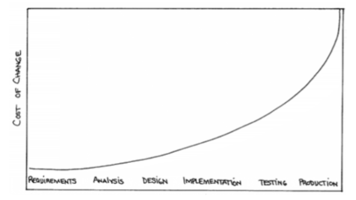
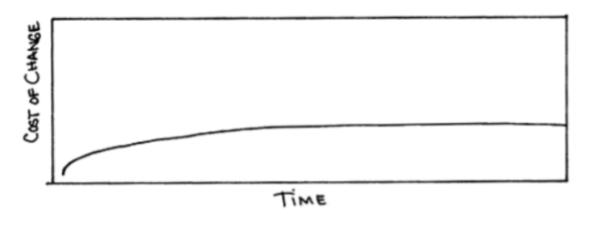

# **Desarrollando software con Excelencia Técnica**

La excelencia técnica es un principio del manifiesto ágil. En 10Pines, este principio forma parte de nuestro ADN. Constituye uno de nuestros pilares de calidad. No perseguimos un perfeccionismo vacío. Creemos que es lo mejor para nuestros clientes: si desarrollamos código, bien diseñado y testeado, se producirá un ahorro de dinero, facilitándose los incrementos de funcionalidad y los cambios de modo sustentable. Por el contrario, trabajar sobre sistemas *legacy* implica un costo muy alto, además de resultar poco reconfortante para quienes debemos trabajar con él. 

Introducimos la excelencia técnica desde el momento mismo en que comenzamos con el desarrollo. No creo que sea factible hacerlo después. El desarrollo de software es un proceso de aprendizaje durante el cual debemos mantener el código limpio.

Pagamos la deuda técnica, refactorizando continuamente. Si no incorporamos el conocimiento que generamos en nuestro *codebase*, este se convertirá en código *legacy* muy rápidamente y ya no podremos seguir incorporando funcionalidad o adaptarnos a los cambios fácilmente.

Todo el código que desarrollamos posee tests automatizados, que certifican la funcionalidad y nos permiten hacer pruebas de regresión eficientemente. 

¡Exploremos los aspectos técnicos del desarrollo de software!

# *Clean Code*

Ron Jeffries dijo que nuestro trabajo consiste en escribir ‘código limpio que funcione’[[1]](desarrollando-software-con-excelencia-tecnica.md#notas-al-pie).  ¿Qué es *clean code*? Extraigo esta definición del [libro homónimo](https://g.co/kgs/5SjcQQ) de Uncle Bob: **A alto nivel, es código bien estructurado, que sigue buenos principios de diseño**. **A bajo nivel, es código cuyas abstracciones tienen nombres relevantes, funciones elegantes, bien formateado y con comentarios útiles** (si todo el resto se cumple, éstos últimos no son necesarios, ¿no?). Es código que expresa su intención de modo claro. Es fácil de entender y, por supuesto, no está duplicado.

Posee tests automatizados que certifican que el código hace lo esperado. El feedback continuo, rápido y barato que estos tests brindan permiten agregar funcionalidad o refactorizar sin temor a romper nada. Y de hacerlo, nos enteraríamos rápidamente (con los cambios aún en nuestras cabezas), permitiéndonos corregir el error sin esfuerzo. Tener buenos tests también es parte del código limpio.

# Deuda Técnica

Ward Cunningham[[2]](desarrollando-software-con-excelencia-tecnica.md#notas-al-pie) acuñó este concepto estableciendo una metáfora del mundo financiero, justamente porque debía explicar la necesidad de un refactor a un *Product Owner* procedente del mundo de las finanzas.

La deuda técnica es un préstamo que nos permite aprender rápidamente. Todos podemos necesitar o requerir de un préstamo en algún momento puntual (o más de uno) de nuestra vida económica o laboral. Sin embargo y al igual que en otros planos, debemos pagar las cuotas pactadas, porque, de lo contrario, los intereses se acumularían, haciendo su cancelación cada vez más difícil. 

Como programadores, muchas veces escribimos código para aprender sobre algún concepto. Cuando aprendemos, debemos empezar a pagar nuestra deuda, refactorizando el código para que quede coherente con el conocimiento adquirido. Si no lo hiciéramos, sucedería exactamente lo mismo que con un préstamo monetario. El código sería cada vez más difícil de comprender y modificar y, consecuentemente, tardaríamos más en agregar funcionalidad. 

# Costo de Cambio

Debo confesar que la primera vez que trabajé usando *Extreme Programming* me resultó tedioso. Trabajar en incrementos funcionales pequeños, hacer *pair programming*, diseñar, testear, refactorizar y revisar el código tan detallada y minuciosamente no fue sencillo. Con los años, fui reconociendo que otras personas tendrían que ‘lidiar’ con ‘mi’ código durante mucho tiempo. También aprendí acerca de la importancia de mantener el *codebase* en buenas condiciones para poder agregar funcionalidad sustentablemente y cambiar la existente con celeridad y confianza. 

Al mismo tiempo, llegó a mis manos un libro de esos que producen un quiebre en la vida profesional: ‘Planning Extreme Programming’ [[Beck01]](bibliografia.md#beck01-beck-kent-extreme-programming-explained-embrace-change-2nd-edition-noviembre-2004). El concepto que deseaba referir aquí es el de ‘costo de cambio’. El autor comienza por un estudio publicado por Barry Boehm en los inicios de los 80s donde sugiere que corregir un error se vuelve exponencialmente más costoso mientras más tarde se detecte (de aquí proviene la famosa frase: ‘un error es 100x más costoso de corregir en producción que al momento de realizar la especificación’). 

Beck sugiere que con ‘la combinación de tecnologías y prácticas de programación’ descritas, la curva puede achatarse de esta manera:

Este concepto fue, para mí, revelador. Quizás Beck pueda haber exagerado un poco (como sugiere Ambler en este [post](http://www.agilemodeling.com/essays/costOfChange.htm)), pero lo crucial es destacar **la importancia de mantener el costo de cambio tan bajo como sea posible** para poder incorporar funcionalidad sustentablemente, adaptándonos al cambio. Mantener el costo de cambio bajo es, en definitiva, un requisito fundamental si queremos ser Ágiles. Si no pudiéramos hacerlo, el resto de las prácticas perderían sentido. Dicho de otro modo, si incorporar funcionalidad se volviese cada vez más costoso, difícilmente podríamos mantener la agilidad.

# Algunas Prácticas Esenciales

## Testing Automátizado

Todo el código que escribimos es acompañado por tests automatizados que se ejecutan continuamente. Permiten tener la mejor *Velocity* posible y desarrollar sustentablemente.  Representan la mejor documentación posible del sistema y adicionalmente soportan el resto de las prácticas de ingeniería que permiten alcanzar la excelencia técnica que buscamos. 

Veamos cada una de estas razones con mayor profundidad:

***Velocity***: Los tests automatizados son la clave fundamental que nos permite desarrollar incrementos de funcionalidad muy rápidamente, sin temor de introducir *bugs*. Permiten enfocarnos en el diseño que resuelve el incremento de funcionalidad actual, alivianando la inmensa complejidad que deberíamos mantener en nuestras cabezas. Al completar la funcionalidad, el conocimiento adquirido queda plasmado en nuevos tests, que generan un círculo virtuoso. Adicionalmente, recibimos feedback casi inmediato de los cambios. Esto amplifica nuestro aprendizaje, nos permite iterarlo rápidamente y plasmarlo en nuevos tests que seguirán generando conocimiento de un modo eficiente. Cuando cometemos un error, los tests nos alertan instantáneamente (cuando todavía tenemos los cambios realizados en nuestras cabezas), pudiendo corregir el problema sin esfuerzo y evitando la introducción de *bugs* que pueden resultar costosos de reparar en el futuro.

**Sustentabilidad**: Los tests automatizados son fundamentales para poder seguir incrementando la funcionalidad del sistema sustentablemente, es decir por un periodo de tiempo largo y a un costo razonable. Durante la construcción del MVP, nos permiten completar *User Stories* sin temor de haber introducido *bugs* en la funcionalidad existente, que se incrementa iteración a iteración. Si, por el contrario, el testing de regresión fuera manual, el esfuerzo se incrementaría linealmente. Cada vez tendremos más funcionalidad que testear. Y si decidiéramos no testear la funcionalidad existente, no reconoceríamos la introducción de *bugs*. En definitiva, no podríamos asegurar que estamos haciendo progreso. Brooks llamó a este fenómeno ‘un paso para adelante y dos para atrás’. Pensemos ahora en la sustentabilidad del producto después de la implementación. Si tenemos suerte, vivirá muchos meses o años durante los cuales será necesaria la incorporación de nueva funcionalidad o el cambio de la existente. Sin una buena suite de tests de regresión, ésto sería imposible. 

**Adaptabilidad**: Para poder ser ágiles, debe ser posible cambiar. Si el costo de cambio fuera grande, sería imposible. Los tests permiten realizar cambios rápidamente, sin temor a equivocarnos. En sistemas *legacy*, que carecen de una buena suite de tests automatizados, no tenemos esa capacidad. La introducción de cambios en la funcionalidad se torna lenta, riesgosa y costosa, con el consecuente impacto en el negocio.

**Documentación viva**: los tests representan la mejor documentación que se pueda tener del producto. Es documentación viva (así denominó a este tipo de documentación Gojko Adzic en *Bridging the Communication Gap* [[Adzic01]](), que siempre está al día. Si algo cambiara y no modificáramos los tests, éstos se romperían. Además, es documentación que continuamente nos brinda feedback, ya que todo el tiempo se ejecuta. Mejor aún, es documentación que podemos ejecutar (*debuggear*) para que nos ayude a entender cierta área del código.

**Soportan otras prácticas**: Finalmente, los tests automatizados nos brindan la seguridad y el feedback inmediato necesarios para realizar un diseño emergente, refactorizar continuamente y para que cada miembro pueda trabajar en cualquier área del código ([*collective code ownership*](https://martinfowler.com/bliki/CodeOwnership.html)). En definitiva, soportan prácticas fundamentales en nuestro objetivo de alcanzar la excelencia técnica. 

Para nosotros, en 10Pines, escribir tests es un hábito. No concebimos el desarrollo de software de otro modo (por esta razón lo evaluamos tan estrictamente durante el proceso de selección). Nos dan el feedback para programar correctamente. Constituyen una práctica esencial para construir el producto con excelencia técnica, nuestra manera de regresionar la funcionalidad eficientemente. 

### Una Estrategia para el Testing Automatizado

Hace ya mucho años, leí un libro de [Testing Ágil](https://g.co/kgs/psuLG6) que me dejó un concepto que siempre valoré: **es importante tener una ‘estrategia de testing automatizado’ para el proyecto**. Lisa y Janet argumentan que cada uno es diferente (negocio, tecnologías, arquitectura, equipo, etc.) y que, por ende, tendrá una estrategia diferente, que debería definir:

- Tipos de tests (unidad, integración, funcionales) y proporciones (donde pondremos más esfuerzo).
- Tecnologías (*frameworks*, herramientas)
- Proceso (cómo afectará esto nuestra *definition of done)* 

Una vez definida la estrategia, deberíamos poder contestar la pregunta: ¿Cómo incrementar la funcionalidad con una buena *velocity* y de manera sustentable?

Desde su lectura, han pasado muchos años y han cambiado muchas cosas. Muchos de nuestros clientes trabajan ahora con equipos distribuidos en diferentes países, haciendo *continuous delivery*. Charlamos mucho de la importancia de la estrategia con Matías Fernández, un colega, lider en uno de estos equipos. Concluimos que, para estas situaciones, la estrategia necesita responder algunas preguntas más:

- Cómo incrementar la funcionalidad sin que el tiempo del *build* se dispare (en un producto grande con miles y miles de tests, este tiempo puede volverse extenso, repercutiendo negativamente en la productividad).
- Cómo lograr que todo el equipo comparta la filosofía de testing, tanto en lo que respecta a la proporción de tipos de tests como en la manera de escribirlos.
- Cómo testear el *deployment*. Cómo asegurar que con cada nuevo deploy no se introduzca ningún problema, teniendo en cuenta que se hacen múltiples *deploys* diarios. Una anécdota que me llamó mucho la atención fue el descubrimiento de un *bug* pequeño, casi imperceptible, pero de un alto impacto económico. ¿Por qué? Porque se producía exactamente en el momento de *checkout*. No se trataba de un error de esos que dejan el servicio fuera de operación, pero provocó pérdidas mucho mayores. Es importante que la estrategia permita sentirnos confidentes que estas cosas no van a ocurrir.
- Qué hacer cuando se reporta un error en producción. Cómo determinar la gravedad y el mejor momento para corregirlo (existen errores que deben corregirse inmediatamente porque imposibilitan el uso del producto y otros que no vale la pena siquiera corregir).

Matías y el resto del equipo hicieron un trabajo excelente, estandarizando la proporción de tests, unificando los enfoques de testing (a través de *pair programing* y *code reviews*), asegurándose que el tiempo del *build* se mantuviera razonable (a través de la optimización del servidor de CI y del tiempo de los tests, etc.) y también a partir del diseño e implementación de un proceso para filtrar errores de producción y agendar su corrección. La estandarización de todos estos puntos en una ‘estrategia de testing automatizado’ del producto produjo una mejora sensible en el proceso de desarrollo que repercutió en la agilidad del negocio.

#### Proporción de Tipos de Tests

Uno de los puntos a definir en la estrategia es qué tipos de tests construiremos y en qué proporción. Mike Cohn publicó una heurística, que ahora conocemos como la pirámide de testing de Cohn. La pirámide está compuesta por 3 tipos de tests: unitarios, integración y GUI. Cada uno de ellos ocupa un área de la pirámide, que metaforiza la proporción recomendada de ese tipo de tests:

Pueden observar que la heurística sugiere que la proporción de tests unitarios sea la mayor, ya que son rápidos y robustos. Luego, siguen los tests de integración, que deben ser menos porque sólo deben testear que las integraciones entre los componentes ya testeados unitariamente funcionen. Finalmente, en la punta y con el área más pequeña vemos las tests de UI, cuya proporción es la menor: Son los más lentos, ya que debemos levantar todo el *stack* tecnológico para ejecutarlo y los menos robustos, pues se rompen con cambios en cualquiera de las capas. En mi experiencia, cuando se rompen, resulta difícil la detección del problema, pues son difíciles de *debuggear* y el logueo del error y de la ejecución son menos descriptivos.

En 2011, Gojko Adzic publicó un libro llamado ‘Especificaciones con Ejemplos’[[Adzic00]](bibliografia.md#adzic00-adzic-gojko-specification-by-example-how-successful-teams-deliver-the-right-software-1st-edition-junio-2011), que generó un gran movimiento en la comunidad. La idea es que estos ejemplos, escritos por el *Product Owner*, se conviertan en los tests automatizados que guíen el desarrollo (usando herramientas como [*cucumber*](<https://cucumber.io/>) y [*capybara*](<https://github.com/teamcapybara/capybara>)). El beneficio es claro: éste se involucra en la creación de los ejemplos, que posteriormente se convierten en documentación viva, que está siempre actualizada y que ejercita el código constantemente. Sin embargo, en mi experiencia personal, nunca pude ver un equipo donde estos tests realmente guíen el desarrollo. Los problemas que observé son:

- El *Product Owner* no se involucraba por completo en la creación de los ejemplos, que terminaban escritos por otros integrantes del equipo (como el tester o el analista). Si no se involucra de este modo, ¿tiene realmente sentido que el test esté escrito en lenguaje natural? En estos casos, lo mejor es que el equipo técnico decida como escribir estos tests.
- Se escriben demasiados tests de este tipo, contradiciendo la pirámide previamente descrita. Según expertos consultados, ésto no debería pasar porque los ejemplos representan los casos más relevantes. Sin embargo, es muy frecuente que suceda.

Por todo esto, prefiero construir los tests funcionales para los ejemplos más relevantes una vez que la funcionalidad esté desarrollada. Por supuesto que el *Product Owner* debería escribir estos ejemplos y entender lo mejor posible que se espera de esa *User Story*. 

## Test Driven Development - by Hernán Wilkinson

## Refactor Continuo

Escribir código es similar a escribir un libro. Me doy cuenta ahora que estoy aprendiendo esto último. No escribo bien y como quiero en una pasada. Escribo una primera versión, la leo, la pienso, pido feedback, la corrijo y refino (o la re-escribo si no me gusta nada). Cuando escribo código, a pesar de haberlo hecho durante muchos más años, me pasa lo mismo. Primero entiendo el problema, bosquejo la posible solución y escribo una primera versión de ella. Luego leo el código y pienso cómo podría mejorarlo. Siempre se me ocurren formas de hacerlo, entonces voy ‘refactorizando’ (ejecutando los tests para estar seguro de que todo sigue funcionando) hasta que me guste. Este proceso de mejora del código no termina cuando completo la *User Story*. Continúa infinitamente mientras trabajo en un proyecto. Es una búsqueda constante del mejor diseño, de lograr la mejor versión del código que funcione.

Esta práctica, descrita en el párrafo anterior, se llama *Continuous Refactoring* y también la popularizó Beck a partir de Extreme Programming. Martin Fowler, autor del famoso libro Refactoring: improving the design of existing code’[[Fowler00]](bibliografia.md), que recientemente sacó a la luz su 2da edición, define un ‘refactor’ como ‘un cambio en la estructura interna del software que lo hace más fácil de entender y más barato de cambiar, sin que se modifique el comportamiento observable’. 

En 10Pines, tenemos casi una obsesión por refactorizar. Lo hacemos todo el tiempo, si no nos gusta el nombre elegido para una variable, si notamos que cierta área del código se volvió demasiado compleja y, por supuesto, si detectamos duplicación en el código. Podemos hacerlo, de forma rápida y confiada, porque existen tests que nos brindan feedback instantáneo y nos alertan ante una falla. Como ya mencioné, estas prácticas funcionan mejor en combinación.

Refactorizar continuamente nos permite mejorar ‘el diseño del código existente’ de modo de mantenernos capaces de incorporar nueva funcionalidad sustentablemente. En otras palabras, nos permite mantener el costo de cambio bajo. Más allá de que nos guste el código elegante, la razón principal es económica.

## Code Review

Antes de incorporar nuestros cambios en el *branch* de desarrollo, es bueno que otro par de ojos le den una mirada. Esta revisión, que llamamos *code review,* brinda observaciones que permiten pulir y mejorar el código antes de ‘*mergearlo*’[[3]](desarrollando-software-con-excelencia-tecnica.md#notas-al-pie). Por ejemplo, nos alerta de un nombre que no se entiende, de cambios que pueden afectar algún área que no tuvimos en cuenta o de algún problema de performance.

El proceso que se ha estandarizado para hacer esta *review*, a partir de la popularización de Git y Github, es la creación de un *pull request*, que se revisa y *mergea* cuando se aprueba. Debemos intentar realizar el *code review* tan pronto como sea posible, de manera de minimizar el trabajo en progreso.

Esta revisión podría ser ‘*online*’, es decir, el revisor mira el código junto con las personas que lo desarrollaron o asincrónica, dejando comentarios y sugerencias. El primer caso es más eficiente porque, mientras se revisa el código, pueden hacerse preguntas y debatir las decisiones tomadas. Sin embargo, ésto implica que los involucrados deban coordinar un horario, con la consecuente incomodidad para el revisor que debe interrumpir sus tareas. Las revisiones asíncronas también funciona correctamente. Incluso, se pueden categorizar los comentarios u observaciones: algunos serán bloqueantes y otros, simples sugerencias.

Esta práctica funciona bien en ambientes sanos y colaborativos donde cualquiera puede hablar con seguridad y funciona mal en ambientes con poca colaboración donde la gente se vuelve muy cautelosa. La confianza es un requisito para que este tipo de prácticas funcionen correctamente. 

## Pair Programming

Agustin y Dario, haciendo *pair-programming* en las 1ras oficinas de 10Pines. Foto extraida de [Wikipedia](https://es.wikipedia.org/wiki/Programaci%C3%B3n_en_pareja)

Si el *code review* es bueno, llevémoslo al extremo, dice Beck en Extreme Programming cuando explica la práctica de *pair programming*. Escribamos el código de a dos, tomando las decisiones juntos, debatiendo ideas y revisando el código escrito. 

Usamos mucho esta práctica para desarrollar *User Stories* difíciles y para transmitir conocimiento. La calidad del código producido es siempre mayor a la que se puede alcanzar trabajando individualmente. Las decisiones se debaten. Las personas combinan sus esfuerzos en procura de un código legible. Suman sus ideas: se debaten, se refinan y se mejoran. Además, las probabilidades de introducir un *bug* se ven reducidas. Nos sentimos bien trabajando de esta manera. Nos divertimos y nos levanta la moral. También nos ayuda a mantener la concentración: no chequeamos el whatsapp cuando estamos haciendo *pair programming* con un compañero. Algunos equipos establecen sesiones con una duración de, por ejemplo, una hora, permitiendo pausas necesarias para realizar tareas sociales.

El año pasado usamos esta práctica en una transformación digital de un cliente de un modo muy efectivo. En una retrospectiva surgió la idea de desarrollar las *stories* haciendo *pair-programming* con un programador del cliente y otro de 10Pines. La combinación de los conocimientos del dominio con los conocimientos prácticos hizo que la productividad y la calidad mejoraran. Además, repercutió positivamente en las relaciones entre los miembros  del equipo.  

Mucho tiempo atrás, se cuestionó la pérdida de productividad que esta práctica podría provocar. Sin embargo, estas hipótesis se rebatieron oportunamente. En la actualidad, nadie cuestiona la productividad que muchos consideran indispensable. 

Al igual que con la práctica de *code review*, pueden surgir problemas en ambientes poco colaborativos. También con programadores acostumbrados a trabajar individualmente durante toda su vida. Como antes afirmamos, la confianza también es un prerrequisito para obtener los mejores resultados a partir de esta práctica.

## Integración Continua

Cuando trabajamos en una *User Story*, creamos un *branch* para poder trabajar enfocados en nuestra funcionalidad. Al completarla, debemos integrar los cambios que se hicieron en el *branch* principal para crear una versión unificada. Este proceso puede resultar complejo, dependiendo del tiempo que nos haya tomado. Cuanto mayor sea, más complejo será, pues habrá más cambios en el *branch* principal.

Para decrementar esta dificultad y, sobre todo, el riesgo que conlleva la integración procuramos que los cambios sean pequeños, para realizarlos rápidamente. En eso consiste, justamente, la práctica de integración continua: trabajar en cambios pequeños que se integran al *branch* principal frecuentemente. De esta manera, ganamos en sencillez y reducimos el riesgo de introducción de *bugs*.

Usamos un servidor de integración continua para reforzar esta práctica y volverla más efectiva. El *workflow* es el siguiente:

- Al comenzar una *User Story* creamos un *branch*. El build verde nos indica que partimos de una base que funciona correctamente.
- Cuando completamos la funcionalidad, *mergeamos* nuestros cambios con los existentes en el *branch* principal. Personalmente, prefiero hacer un *rebase* para dejar los *commits* ordenados.
- Una vez combinados los cambios, corremos los tests. Generalmente, es más cómodo y rápido *pushear* los cambios y dejar que el servidor de integración continua lo haga. 
- Si el build está verde, estamos listos para crear el *pull request* y *mergear* los cambios (momento indicado para pedir *code review*). Si, por el contrario, falló algún test, debemos corregirlo. No podemos *mergear* un *build* que no esté verde.
- Nuestro trabajo no termina aquí. Una vez *mergeado* nuestro *branch* al *branch* principal, verificamos que el build esté verde. De existir un problema, resulta fundamental su inmediata corrección a fin de evitar el bloqueo del resto del equipo.

Integrar continuamente hace nuestro trabajo sustancialmente más sencillo. Nos sentimos más seguros, ya que estamos trabajando en una versión reciente del código. Cuando rompemos algo, tenemos los cambios en la cabeza, facilitando enormemente su corrección. Ésto reduce la probabilidad de introducción de bugs, difíciles de detectar y corregir. 

En conclusión, la práctica de integración continua resulta fundamental en nuestra búsqueda por alcanzar la excelencia técnica.

# La pared de Scrum

> “No podemos cumplir nuestros compromisos, no podemos hacer releases, nuestros clientes se frustran y se enojan. Parece que Scrum estuviera roto.”[[4]](desarrollando-software-con-excelencia-tecnica.md#notas-al-pie)

¿Qué pasa cuando hacemos Scrum, pero no utilizamos las prácticas previamente descritas? Pues nos chocamos con la pared de Scrum[[5]](desarrollando-software-con-excelencia-tecnica.md#notas-al-pie). La metáfora es muy visual. No es posible hacer desarrollo de software sin usar las prácticas mencionadas en las secciones anteriores.

# Manifiesto de *Software Craftsmanship* 

¿El Manifiesto Ágil debería haber prestado mayor atención a los aspectos técnicos? Escuché esta pregunta en reiteradas ocasiones. Marick, uno de los signatarios, en su presentación ‘7 años después: lo que el manifiesto dejó afuera’[[6]](desarrollando-software-con-excelencia-tecnica.md#notas-al-pie) contesta esta pregunta.

Años después de la aparición del manifiesto, surgió un movimiento que, esta vez sí, puso la carga fundamental en el aspecto técnico. Se redactó un manifiesto de [*software craftsmanship*](http://manifesto.softwarecraftsmanship.org/) (en la actualidad, los *craftsmen* se volvieron *crafters* gracias al movimiento feminista) como contraposición a su precedente ágil, muy popular a esta altura, donde se expuso la valoración del software ‘bien hecho’[[7]](desarrollando-software-con-excelencia-tecnica.md#notas-al-pie) así como la necesidad de una comunidad de profesionales capacitados para realizar esta labor. Los creadores de este manifiesto nos hicieron comprometer con el respeto por la profesión, abrazando un sentimiento de orgullo por lo que hacemos. Finalmente, establecieron un camino para llegar a la maestría, tomando como modelo los oficios tradicionales donde se comienza siendo un aprendiz que copia y repite al *master* hasta volverse uno con el correr del tiempo.

# Sobre Prácticas Técnicas y Prácticas de Gestión - by Nicolas Paez

Me acerqué a *Agile* allá por 2004 apróximadamente. Lo hice desde Extreme Programming (XP): un enfoque ágil que es muy explícito respecto de la excelencia técnica y que, en términos generales, incluye las prácticas mencionadas en las secciones precedentes. Durante un tiempo, hasta 2005 / 2006, XP fue el método ágil más popular. Luego fue desplazado por Scrum, el enfoque ágil más utilizado en la actualidad. Paralelamente, también se popularizaron algunas implementaciones de Scrum, que en 2009 fueron bautizadas por Martin Fowler como *Flaccid Scrum*[[7]](desarrollando-software-con-excelencia-tecnica.md#notas-al-pie). Estas implementaciones se caracterizan por la ausencia de prácticas técnicas lo cual, en términos de desarrollo ágil de software, implica una contradicción. Con el correr del tiempo, surgieron distintos movimientos que, a veces intencionalmente y otras no, fueron disociando las prácticas ágiles de índole técnica de aquellas ligadas a la gestión. Éstas últimas empezaron a denominarse “prácticas ágiles” a secas, mientras que las primeras, “prácticas de ingeniería”. Constituye una evidencia de ésto el reporte anual sobre el estado de Agile publicado por Version One[[8]](desarrollando-software-con-excelencia-tecnica.md#notas-al-pie). 

Creo que este fenómeno de la “falta de excelente técnica” se debe en parte a la expansión de *Agile* hacía otros contextos por fuera del desarrollo de software donde las denominadas prácticas técnicas como TDD y *pair-programming* no tienen aplicación. Alguien podrá argumentar que si mi contexto es relativo a la confección de prendas entonces en lugar de *pair-programming* podría hacer ‘*pair-bordado’*, pero precisamente no sería *pair-programming* sino algo análogo que podría o no traer un beneficio.

En mi ejercicio profesional también fui testigo de esta “agilidad sin excelencia técnica”. He visto muchos equipos diciendo que trabajaban *Agile* pero con una completa ausencia de excelencia técnica (más aún, en algunos casos no tenían excelencia de ningún tipo). En un intento de no hacer generalizaciones prejuiciosas e incorrectas, decidí buscar sustento formal para mis percepciones. Así fue como me sumé a un grupo de investigación en la Universidad Nacional de Tres de Febrero. 

Con este grupo nos propusimos, como primer objetivo, entender cómo era el uso de prácticas ágiles en América Latina, analizándolas desde una perspectiva dual de prácticas técnicas y de gestión. Como metodología de investigación decidimos usar encuestas. Establecimos el conjunto de prácticas a estudiar y definimos un criterio para categorizarlas:

- **Prácticas de gestión**: son aquellas que nos ayudan a organizar el proyecto y que tienen aplicación incluso en proyectos que no sean de desarrollo de software.
- **Prácticas técnicas**: son aquellas exclusivas al desarrollo de software y cuya aplicación no es posible (o carece de sentido) en proyectos que no sean propios del área.

Partiendo de esta definición, elegimos un total de seis prácticas: tres de gestión y tres técnicas y armamos un cuestionario para entender el nivel de éstas. Decidimos realizar la encuesta en una conferencia de *Agile* y, para tal fin, consultamos a los participantes del *Agile Open Camp* Bariloche 2016. Los resultados, junto con nuestro análisis y conclusiones consecuentes, fueron publicados en el Congreso Nacional de Ingeniería Informática y Sistemas de Información CONAIISI 2016. Repetimos la encuesta en dos ocasiones. En el *Agile Open Camp* Chile 2017, estudiando en este caso ocho prácticas: las seis que constituían el estudio anterior más dos nuevas. Finalmente, extendimos nuestro estudio a diez prácticas, encuestando a los participantes de la Conferencia Latinoamericana de Métodos Ágiles 2017.

El listado final de prácticas de nuestro estudio incluyó:

- Prácticas de gestión:

- - Proceso iterativo
  - *Release* frecuente
  - Retrospectivas
  - Auto-organización
  - Propiedad Colectiva

- Prácticas técnicas:

- - Automatización de pruebas
  - Integración Continua
  - *Test-Driven Development*
  - Diseño Emergente
  - Pair-Programming

La siguiente tabla muestra comparativamente distintas características de estas tres conferencias:

| Característica                            | *Agile Open Camp* 2016 | *Agile Open Camp* 2017 | Ágiles 2017 |
| ----------------------------------------- | ---------------------- | ---------------------- | ----------- |
| Cantidad de encuestas luego de depuración | 44                     | 49                     | 107         |
| Participantes de la conferencia           | 98                     | 79                     | ~800        |
| Cantidad de prácticas estudiadas          | 6                      | 8                      | 10          |

En las 3 etapas/encuestas de nuestro estudio llegamos a las mismas conclusiones:

- Las prácticas de gestión tienen un mayor grado de adopción que las prácticas técnicas. Más concretamente y de acuerdo a nuestra última encuesta, las de gestión tienen un nivel de adopción que supera el 63%, mientras que el nivel de adopción de las técnicas no supera el 60%.
- La cantidad de prácticas utilizadas aumenta junto con la experiencia de la organización en el uso de métodos ágiles, o sea: a mayor experiencia, mayor adopción de prácticas.
- La diferencia de adopción entre prácticas técnicas y de gestión se acorta mientras mayor sea la experiencia de la organización en el uso de métodos ágiles. Organizaciones con poca experiencia en *Agile* usan pocas prácticas (~4), en general de gestión. Organizaciones con más experiencia usan más prácticas (~7) y la mezcla entre aquellas propias de la gestión y las técnicas es más pareja.

El trabajo final de nuestro estudio que agrupa las 3 encuestas fue publicado en la *International Conference on Agile Software Development* 2018. Quienes gusten ver los detalles del estudio pueden consultarlo en:  <https://link.springer.com/chapter/10.1007%2F978-3-319-91602-6_10>.

Una posible implicancia de estas conclusiones es que para muchas organizaciones el camino de adopción de *Agile* comienza por las prácticas de gestión e incorpora prácticas técnicas en una segunda instancia. Personalmente he visto esta situación en reiteradas ocasiones y en muchos casos esa segunda instancia nunca llega. Al mismo tiempo, trabajando como consultor, ayudando en la adopción de *Agile*, introduje las prácticas técnicas desde el inicio, pero tampoco funcionó. Inicialmente el equipo las incorporó, pero cuando el zapato apretó, sin prácticas de gestión establecidas ni disciplina para cumplir los acuerdos de trabajo, las dejó de lado, retornando “al lado oscuro”, donde no hay excelencia técnica.

Esto me lleva a pensar que el camino de adopción de *Agile* debe ser holístico y orgánico, incorporando simultáneamente prácticas de gestión y prácticas ágiles, pues no hay agilidad posible sin excelencia técnica.

# Conclusión

Buscamos la excelencia técnica continuamente. Para alcanzarla, trabajamos de forma disciplinada usando las prácticas ingenieriles descritas originalmente en *Extreme Programming*. Queremos desarrollar código ‘limpio’, bien diseñado y bien testeado. Creemos que es la manera más eficiente de lograr el valor que buscamos aportar a nuestros clientes y la más efectiva para desarrollar software sustentablemente, con la calidad esperada. 

# Notas al Pie

1. Clean code that works.
2. Ward, un personaje esencial en el nacimiento del movimiento ágil, pero de un perfil muy bajo hizo un video que está en [youtube](https://www.youtube.com/watch?v=pqeJFYwnkjE) y resume este concepto de modo mucho más claro.
3. Anglicismo muy utilizado, equivalente al verbo fusionar de nuestra lengua.
4. You can’t keep your commitments, you can’t release software, your customers get annoyed and angry, it looks like Scrum is broken.
5. [The Scrum Wall](https://www.allankellyassociates.co.uk/archives/869/scrum-wall-another-agile-failure-mode/)
6. [Seven Years Later: What the Agile Manifesto Left Out](https://www.stickyminds.com/sites/default/files/presentation/file/2013/08BADPR_WK1.pdf)
7. Traducción literal de los términos ‘well crafted*’*
8. https://martinfowler.com/bliki/FlaccidScrum.html
9. <https://stateofagile.versionone.com/> - Algunos referentes de la comunidad ágil como Joshua Kerievsky han manifestado explícitamente su oposición a esta tendencia. https://www.linkedin.com/pulse/stop-calling-them-technical-practices-joshua-kerievsky/

