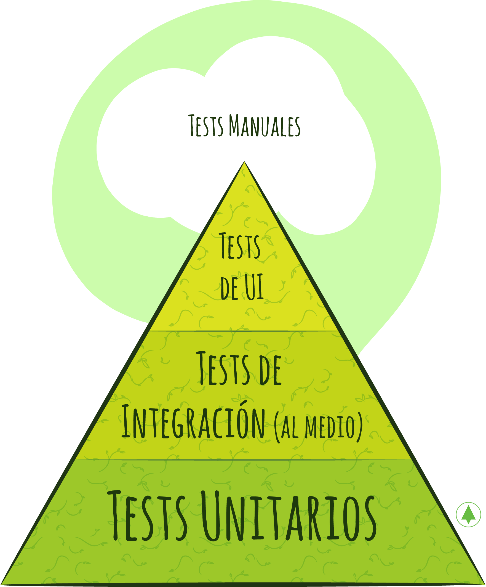
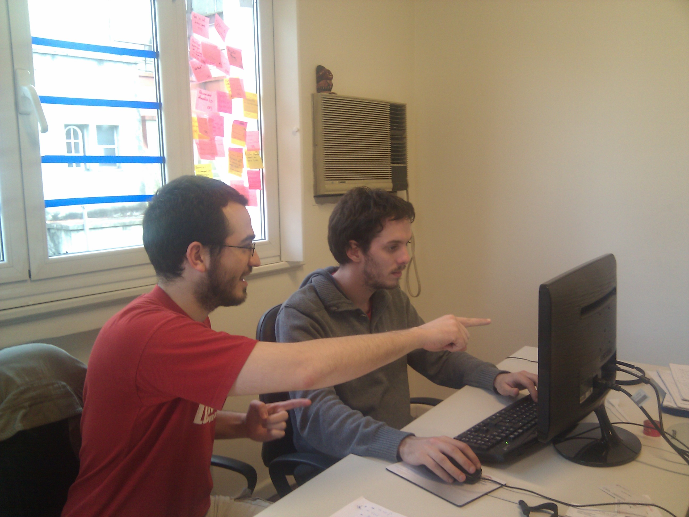

# **Introducción**

La excelencia técnica es un principio del manifiesto ágil. En 10Pines, este principio forma parte de nuestro ADN. Constituye uno de nuestros pilares de calidad. No perseguimos un perfeccionismo vacío. Creemos que es lo mejor para nuestros clientes: si desarrollamos código, bien diseñado y testeado, se producirá un ahorro de dinero, facilitándose los incrementos de funcionalidad y los cambios de modo sustentable. Por el contrario, trabajar sobre sistemas *legacy* implica un costo muy alto, además de resultar poco reconfortante para quienes debemos trabajar con él. 

Introducimos la excelencia técnica desde el momento mismo en que comenzamos con el desarrollo. No creo que sea factible hacerlo después. El desarrollo de software es un proceso de aprendizaje durante el cual debemos mantener el código limpio.

Pagamos la deuda técnica, refactorizando continuamente. Si no incorporamos el conocimiento que generamos en nuestro *codebase*, este se convertirá en código *legacy* muy rápidamente y ya no podremos seguir incorporando funcionalidad o adaptarnos a los cambios fácilmente.

Todo el código que desarrollamos posee tests automatizados, que certifican la funcionalidad y nos permiten hacer pruebas de regresión eficientemente. 

¡Exploremos los aspectos técnicos del desarrollo de software!

# *Clean Code*

Ron Jeffries dijo que nuestro trabajo consiste en escribir "código limpio que funcione"[[1]](desarrollando-software-con-excelencia-tecnica.md#notas-al-pie).  ¿Qué es *clean code*? Extraigo esta definición del [libro homónimo](https://g.co/kgs/5SjcQQ) de Uncle Bob: **A nivel alto, es código bien estructurado, que sigue buenos principios de diseño**. **A nivel bajo, es código cuyas abstracciones tienen nombres relevantes y funciones elegante. Está bien formateado y contiene comentarios útiles** (si todo el resto se cumple, estos últimos no son necesarios, ¿no?). Es código que expresa su intención de modo claro. Es fácil de entender y, por supuesto, no está duplicado.

Posee tests automatizados que certifican que el código hace lo esperado. El feedback continuo, rápido y barato que estos tests brindan nos permite agregar funcionalidad o refactorizar sin temor a romper nada. De hacerlo, nos enteraríamos rápidamente (con los cambios aún en nuestras cabezas), permitiéndonos corregir el error sin esfuerzo. Tener buenos tests también es parte del código limpio.

# Deuda Técnica

Ward Cunningham[[2]](desarrollando-software-con-excelencia-tecnica.md#notas-al-pie) acuñó este concepto estableciendo una metáfora del mundo financiero, justamente porque debía explicar la necesidad de un *refactor* a un *Product Owner* procedente del mundo de las finanzas.

La deuda técnica es un préstamo que nos permite aprender rápidamente. Todos podemos necesitar o requerir de un préstamo en algún momento puntual de nuestra vida económica o laboral. Sin embargo y al igual que en otros planos, debemos pagar las cuotas pactadas. De lo contrario, los intereses se acumularían, haciendo su cancelación cada vez más difícil. 

Como programadores, muchas veces escribimos código para aprender sobre algún concepto. Al hacerlo, debemos empezar a pagar nuestra deuda, refactorizando el código para que refleje el conocimiento adquirido. Si no lo hiciéramos, sucedería exactamente lo mismo que con un préstamo monetario, ya que no estaríamos pagando las cuotas: el código sería cada vez más difícil de comprender y modificar y, consecuentemente, se volvería más costoso agregar funcionalidad. 

# Costo de Cambio

Debo confesar que la primera vez que trabajé usando *eXtreme Programming* me resultó tedioso. Trabajar en incrementos funcionales pequeños, hacer *pair programming*, diseñar, testear, refactorizar y revisar el código tan detallada y minuciosamente no fue sencillo. Con los años, fui reconociendo que otras personas tendrían que "lidiar" con "mi" código durante mucho tiempo. También aprendí acerca de la importancia de mantener el *codebase* en buenas condiciones para poder agregar funcionalidad sustentablemente y cambiar la existente con celeridad y confianza. 

Al mismo tiempo, llegó a mis manos un libro de esos que producen un quiebre en la vida profesional: "*Planning eXtreme Programming*" [[Beck01]](bibliografia.md#beck01-beck-kent-extreme-programming-explained-embrace-change-2nd-edition-noviembre-2004). El concepto que deseaba referir aquí es el de "costo de cambio". El autor comienza por un estudio publicado por Barry Boehm a comienzos de los 80s donde sugiere que corregir un error se vuelve exponencialmente más costoso mientras más tarde se detecte (de aquí proviene la famosa frase: "un error es 100x más costoso de corregir en producción que al momento de realizar la especificación"). 


Beck sugiere que con "la combinación de tecnologías y prácticas de programación" descritas, la curva puede achatarse de esta manera:


Este concepto fue, para mí, revelador. Quizás Beck pueda haber exagerado un poco (como sugiere Ambler en este [post](http://www.agilemodeling.com/essays/costOfChange.htm)), pero lo crucial es destacar **la importancia de mantener el costo de cambio tan bajo como sea posible** para poder incorporar funcionalidad sustentablemente, adaptándonos al cambio. Mantener el costo de cambio bajo es, en definitiva, un requisito fundamental si queremos ser Ágiles. Si no pudiéramos hacerlo, el resto de las prácticas perderían sentido. Dicho de otro modo, si incorporar funcionalidad se volviese cada vez más costoso, difícilmente podríamos mantener la agilidad.

# Algunas prácticas esenciales

## Testing automátizado

Todo el código que escribimos es acompañado por tests automatizados que se ejecutan continuamente. Permiten tener la mejor *Velocity* posible y desarrollar sustentablemente.  Representan la mejor documentación del sistema y adicionalmente soportan el resto de las prácticas de ingeniería que permiten alcanzar la excelencia técnica que buscamos. 

Veamos cada una de estas razones con mayor profundidad:

***Velocity***: Los tests automatizados son fundamentales porque nos permite desarrollar incrementos de funcionalidad muy rápidamente, sin temor de introducir *bugs*. Permiten enfocarnos en el diseño que resuelve el incremento de funcionalidad actual, alivianando la inmensa complejidad que deberíamos mantener en nuestras cabezas. Al completar la funcionalidad, el conocimiento adquirido queda plasmado en nuevos tests, que generan un círculo virtuoso. Adicionalmente, recibimos feedback casi inmediato de los cambios. Esto amplifica nuestro aprendizaje, nos permite iterarlo rápidamente y plasmarlo en nuevos tests que seguirán generando conocimiento de un modo eficiente. Cuando cometemos un error, los tests nos alertan instantáneamente, pudiendo corregir el problema sin esfuerzo (porque todavía tenemos los cambios realizados en nuestras cabezas) y evitando la introducción de *bugs* que pueden resultar costosos de reparar en el futuro.

**Sustentabilidad**: Los tests automatizados son fundamentales para poder seguir incrementando la funcionalidad del sistema sustentablemente, es decir, por un periodo de tiempo largo y a un costo razonable. Durante la construcción del MVP, nos permiten completar *User Stories* sin temor de haber introducido *bugs* en la funcionalidad existente, que se incrementa iteración a iteración. Si, por el contrario, el testing de regresión fuera manual, el esfuerzo se incrementaría linealmente. Cada vez tendremos más funcionalidad que testear. Y si decidiéramos no testear la funcionalidad existente, no reconoceríamos la introducción de *bugs*. En definitiva, no podríamos asegurar que estamos haciendo progreso. Brooks llamó a este fenómeno "un paso para adelante y dos para atrás". Pensemos ahora en la sustentabilidad del producto después de la implementación: si tenemos suerte, vivirá muchos meses o años durante los cuales será necesaria la incorporación de nueva funcionalidad o el cambio de la existente. Sin una buena suite de tests de regresión, sería imposible. 

**Adaptabilidad**: Para poder ser ágiles, debe ser posible cambiar. Si el costo de cambio fuera grande, sería imposible. Los tests permiten realizar cambios rápidamente, sin temor a equivocarnos. En sistemas *legacy*, que carecen de una buena suite de tests automatizados, no tenemos esa capacidad. La introducción de cambios en la funcionalidad se torna lenta, riesgosa y costosa, con el consecuente impacto en el negocio.

**Documentación viva**: los tests representan la mejor documentación posible del producto, documentación
viva (así la denominó Gojko Adzic en  *Bridging the Communication Gap* [[Adzic01]](), que siempre está al día. Si algo cambiara y no modificáramos los tests, estos se romperían. Además, es documentación que continuamente nos brinda feedback, ya que todo el tiempo se ejecuta. Mejor aún, es documentación que podemos *debuggear* para entender el código.

**Soportan otras prácticas**: Finalmente, los tests automatizados nos brindan la seguridad y el feedback inmediato necesarios para realizar un diseño emergente, refactorizar continuamente y para que cada miembro pueda trabajar en cualquier área del código ([*collective code ownership*](https://martinfowler.com/bliki/CodeOwnership.html)). En definitiva, soportan prácticas fundamentales en nuestro objetivo de alcanzar la excelencia técnica. 

Para nosotros, en 10Pines, escribir tests es un hábito. No concebimos el desarrollo de software de otro modo (por esta razón lo evaluamos tan estrictamente durante el proceso de selección). Nos dan el feedback para programar correctamente. Constituyen una práctica esencial para construir el producto con excelencia técnica. 

### Una Estrategia para el testing automatizado

Hace ya mucho años, leí un libro de [Testing Ágil](https://g.co/kgs/psuLG6) que me dejó un concepto que siempre valoré: **es importante tener una "estrategia de testing automatizado" para el proyecto**. Lisa y Janet argumentan que cada uno es diferente (negocio, tecnologías, arquitectura, equipo, etc.) y que, por ende, tendrá una estrategia diferente, que debería definir:

- Tipos de tests (unidad, integración, funcionales) y proporciones (donde pondremos más esfuerzo).
- Tecnologías (*frameworks*, herramientas)
- Proceso (cómo afectará nuestra *definition of done)* 

Una vez definida la estrategia, deberíamos poder contestar la pregunta: ¿Cómo incrementar la funcionalidad de manera sustentable y con una buena *Velocity*?

Desde su lectura, han pasado muchos años y han cambiado muchas cosas. Muchos de nuestros clientes trabajan ahora con equipos distribuidos en diferentes países, haciendo *continuous delivery*. Charlamos mucho de la importancia de la estrategia con Matías Fernández, un colega, lider en uno de estos equipos. Concluimos que, para estas situaciones, la estrategia necesita responder algunas preguntas más:

- Cómo incrementar la funcionalidad sin que el tiempo del *build* se dispare (en un producto grande con miles y miles de tests, este tiempo puede volverse extenso, repercutiendo negativamente en la productividad).
- Cómo lograr que todo el equipo comparta la filosofía de testing, tanto en lo que respecta a la proporción de tipos de tests como en la manera de escribirlos.
- Cómo testear el *deployment*. Cómo asegurar que, con cada nuevo deploy, no se introduzca ningún problema, teniendo en cuenta que se hacen múltiples *deploys* diarios. Una anécdota que me llamó mucho la atención fue el descubrimiento de un *bug* pequeño, casi imperceptible, pero de un alto impacto económico. ¿Por qué? Porque se producía exactamente en el momento de *checkout*. No se trataba de un error de esos que dejan el servicio fuera de operación, pero provocó pérdidas mucho mayores. Es
  importante que la estrategia permita sentirnos confiados de que estas cosas no van a ocurrir.
- Qué hacer cuando se reporta un error en producción. Cómo determinar la gravedad y el mejor momento para corregirlo (existen errores que deben corregirse inmediatamente porque imposibilitan el uso del producto y otros que no vale la pena siquiera corregir).

Matías y el resto del equipo hicieron un trabajo excelente, estandarizando la proporción de tests, unificando los enfoques de testing (a través de *pair programing* y *code reviews*), asegurándose que el tiempo del *build* se mantuviera razonable (a través de la optimización del servidor de CI y del tiempo de los tests, etc.) y también a partir del diseño e implementación de un proceso para filtrar errores de producción y agendar su corrección. La estandarización de todos estos puntos en una "estrategia de testing automatizado" del producto produjo una mejora sensible en el proceso de desarrollo que repercutió en la agilidad del negocio.

#### Proporción de tipos de tests

Uno de los puntos a definir en la estrategia es qué tipos de tests construiremos y en qué proporción. Mike Cohn publicó una heurística, que ahora conocemos como la pirámide de testing de Cohn. La pirámide está compuesta por 3 tipos de tests: unitarios, integración y GUI. Cada uno de ellos ocupa un área de la pirámide, que metaforiza la proporción recomendada de ese tipo de tests:



Pueden observar que la heurística sugiere que la proporción de tests unitarios debería ser la mayor, ya que son rápidos y robustos. Luego, seguirían los de integración, en menor cantidad, pues sólo deberían testear el funcionamiento de las integraciones entre componentes ya testeados unitariamente. Finalmente, en la punta y con el área más pequeña los tests de *UI*, cuya proporción debería ser la menor: son los más lentos, ya que debemos levantar todo el *stack* tecnológico para ejecutarlos y los menos robustos, pues se rompen con cambios en cualquiera de las capas (en mi experiencia, cuando fallan, resulta difícil la detección del problema, pues son difíciles de *debuggear* y el logueo del error y de la ejecución son menos descriptivos).

En 2011, Gojko Adzic publicó un libro llamado "Especificaciones con Ejemplos"[[Adzic00]](bibliografia.md#adzic00-adzic-gojko-specification-by-example-how-successful-teams-deliver-the-right-software-1st-edition-junio-2011), que generó un gran movimiento en la comunidad. La idea es que estos ejemplos, escritos por el *Product Owner*, se conviertan en los tests automatizados que guíen el desarrollo (usando herramientas como [*cucumber*](<https://cucumber.io/>) y [*capybara*](<https://github.com/teamcapybara/capybara>)). El beneficio es claro: se involucra en la creación de los ejemplos, que posteriormente se convierten en documentación viva, que está siempre actualizada y que ejercita el código constantemente. Sin embargo, en mi experiencia personal, nunca pude ver un equipo donde estos tests realmente guíen el desarrollo. Los problemas que observé son:

- El *Product Owner* no se involucraba por completo en la creación de los ejemplos, que terminaban escritos por otros integrantes del equipo (como el tester o el analista). En consecuencia, ¿tiene realmente sentido que el test esté escrito en lenguaje natural? En estos casos, lo mejor es que el equipo técnico decida como escribir estos tests.
- Se escriben demasiados tests de este tipo, contradiciendo la pirámide previamente descrita. Según expertos consultados, ésto no debería pasar porque los ejemplos deberían representan los casos más relevantes. Sin embargo, es muy frecuente que suceda.

Por todo esto, prefiero construir los tests funcionales para los ejemplos más relevantes una vez que la funcionalidad esté desarrollada.

## *Test Driven Development* - por Hernán Wilkinson

¿Qué es *Test Driven Development*? O para hacerlo más simple, TDD. ¿Cuándo hay que usarlo y cuándo no? ¿Para qué sirve y para qué no? ¿Se puede usar siempre, en cualquier sistema, en cualquier contexto? Si desarrollamos con TDD, ¿es necesario tener QA? Estas y muchas preguntas más son las que recibimos cada vez que hablamos o damos un curso de TDD. Voy a tratar de responderlas en esta sección. No será fácil. Seguramente algunas preguntas queden sin responder y se generen otras. Está bien que así suceda: es parte de todo crecimiento intelectual la generación de dudas. Sin ellas no se aprende, no se crece. En esta introducción les dejo mi primer consejo: ante la duda, practiquen, prueben y jueguen con el tema. Aprendan haciendo.

Nuestra querida profesión está bendecida y maldecida al mismo tiempo por una característica esencial, como diría Fred Brooks en "*No Silver Bullet*": la "maleabilidad" del producto que generamos, la facilidad para cambiarlo, para experimentar con él, y, como decía Marvin Minsky en su paper "*Why Programming is a Good Medium for Expressing Poorly Understood and Sloppily Formulated Ideas*", para probar prácticamente las teorías de conocimiento que tenemos sobre un problema.

La práctica, en nuestra profesión, resulta esencial para aprender. Espero generar muchas dudas en ustedes, pero sobre todo que puedan responderlas ustedes mismos programando. Es la mejor manera de aprender.

Me gustaría empezar con un poco de historia. Conocerla ayuda a entender cómo surgió, en este caso TDD, y qué podemos esperar del futuro. Podríamos marcar el comienzo "formal" de TDD en octubre del año 1994 cuando Kent Beck publica en la *Smalltalk Report* (una revista dedicada al lenguaje *Smalltalk* de la década del 90. Sí, en los 90 habían revistas de lenguajes de programación) el artículo "*Simple Smalltalk Testing*", donde describe un *framework* de "*unit testing*" que estaba utilizando para verificar que el código escrito funcionase como esperaba. Kent Beck centra su atención en "*testing*", o sea en escribir tests luego de que el "código" estuviese desarrollado. Más allá de eso, fue la semilla que terminó evolucionando en lo que conocemos como TDD. Este *framework* de *testing* es el que luego evolucionó como *SUnit* y del cual derivan aquellos correspondientes a otros lenguajes de programación como JUnit para Java, NUnit para .Net, etc. 

Él comenta que en el proceso de “germinación” de TDD influyeron mucho las enseñanzas o vivencias de su padre quien fue desarrollador de software y quien le inculcó la importancia de la verificación de lo que uno hace.

Recuerdo que, allá por el año 1998, mientras trabajaba como consultor de la AFIP, otorgué a una desarrolladora de mi equipo la responsabilidad de implementar un "*framework* de *testing*" en Java, idea que había sacado, claro está, del artículo mencionado. Ya se empezaba a vislumbrar, a sentir, por entonces la importancia del testing automatizado. Dicha programadora, cuyo nombre lamentablemente no recuerdo, realizó un excelente trabajo que no prosperó en el resto del grupo de trabajo por dos razones: 1) la aversión de los programadores a testear, ¿cómo un programador iba a "perder tiempo" testeando? Para eso estaba QA, para algo se les pagaba a ellos. 2) Dejé de trabajar en la AFIP :-)

Kent Beck terminó de dar forma a la idea de TDD y aplicarla en ese famoso proyecto C3 de la empresa *Chrysler*, desarrollando en Smalltalk[[3]](desarrollando-software-con-excelencia-tecnica.md#notas-al-pie) un sistema de *payroll* del cual surge no sólo la idea de TDD sino también de XP (*eXtreme Programming*).

En 1999, Beck edita "*eXtreme Programming Explained*" donde, entre otras cosas, "eleva" la importancia del testing automatizado, hablando principalmente de "*unit testing*" (tests unitarios). En mi caso, que venía siguiendo a Beck en todas sus publicaciones, no dudé en comprar el libro y leerlo inmediatamente. Quedé maravillado con lo expuesto y lo implementé rápidamente. No me tuvo que convencer, lo tratado por el texto era "lo natural". Por fin alguien se animaba a decirlo y rompía con los mandatos "tayloreanos" y "cascadosos" a los que nos tenían acostumbrados los supuestos gurúes de la "ingeniería de software". 

Sin embargo, la técnica no quedará formalizada hasta el año 2000, con la edición de "*TDD By Example*"[[Beck02]](bibliografia.md#beck02). Beck estipula 3 pasos para hacer TDD:

1. *Red Step*: Escribir un test simple que falle al ser corrido.
2. *Green Step*: Implementar sólo lo necesario **y nada más que lo necesario** (el destacado es mío) para que el test pase, cometiendo todos los "pecados" de programación y diseño que se nos ocurran.
3. *Refactor Step*: ¡Confesarse! Beck no lo plantea con estas palabras, sino que propone eliminar la duplicación creada en el paso 2. En definitiva, "sacarse los pecados de encima" o, en términos más técnicos, hacer un buen diseño.

Como se puede ver la técnica no es compleja. Consta de tres pasos simples, fáciles de recordar y explicar, que, sin embargo, resultan difíciles de seguir y de aplicar (veremos más adelante por qué). 

Estos tres pasos no explican qué es TDD, sino que definen cómo se hace. ¿Qué es TDD entonces? ¿cuál es su esencia? ¿qué hace que TDD sea lo que es y no sea otra cosa? TDD es una técnica de desarrollo de software iterativa e incremental con feedback inmediato. En pocas palabras, una técnica que favorece el proceso de aprendizaje que todo ser humano lleva adelante cuando debe entender, explicar y formalizar qué es y cómo funciona algo. En definitiva, cuando debe programar.

Para comprender bien TDD y poder aplicarlo correctamente, no podemos perder de vista que debemos desarrollar de manera iterativa, agregando en cada iteración un nuevo incremento a nuestra solución para obtener feedback rápido que valide que estoy en el camino correcto.

Veamos esto con un ejemplo. En la introducción comenté la importancia de practicar para aprender y quiero ser consistente con lo que dije (aunque a veces la inconsistencia me supera). Por ello, para explicar cada paso y sus causas, utilizaré un ejemplo sencillo, el de *[Conways Game Of Life](https://en.wikipedia.org/wiki/Conway's_Game_of_Life)*. Básicamente consiste en un tablero bidimensional compuesto por celdas vivas o muertas, donde se van creando nuevas generaciones a partir de las siguientes reglas:

1. Una celda viva con menos de dos vecinos vivos muere (subpoblación).
2. Una celda viva con dos o tres vecinos vivos sigue viva.
3. Una celda viva con más de tres vecinos vivos muere (sobrepoblación).
4. Una celda muerta con exactamente tres vecinos vivos resucita (reproducción).

Dado este problema, ¿cómo empezamos? La respuesta es clara: hay que escribir el test más simple que se nos ocurra. ¿Por qué debe ser el test más simple? Porque la idea es no caer en análisis-parálisis: tener algo funcionando lo más rápido posible para entrar en un flujo de trabajo virtuoso y sostenible. Además, para poder resolver un problema grande debemos particionarlo. Es conveniente comenzar por la parte más chica y simple de todas ya que nos asegura una solución rápida. Estos motivos nos brindan pistas acerca de lo que debemos medir cuando estamos haciendo TDD, para saber si lo estamos haciendo correctamente. 

Sí, TDD nos da un método de trabajo medible, predecible y que, por lo tanto, nos permite reflexionar y mejorar a partir de dichas mediciones. Nótese que esto no es así con la técnica "clásica" de desarrollo donde, de manera poco clara y a veces caótica, se empieza por la implementación de una clase, luego se pasa a otra y posteriormente se retorna a la anterior sin orden ni guía, más allá de la idea mental acerca de la solución que deseamos generar. Con TDD esto no sucede: existen pasos bien estipulados por lo que podemos reflexionar qué tan bien los estamos haciendo y actuar en consecuencia.

¿Cuál es la medición más importante que debemos realizar cuando hacemos TDD? El tiempo que nos lleva cada paso. Recuerden, queremos feedback inmediato. Por lo tanto, cuanto más rápido hagamos cada paso, mejor. Demorar mucho tiempo en escribir un test es un indicio de que algo no estamos haciendo bien. Posiblemente no estemos encarando el test más simple. En tal caso, deberíamos repensar qué testear. O quizás es el más sencillo, pero estoy tardando porque escribirlo resulta muy complejo debido a que el diseño del sistema no me ayuda. Por lo tanto, debería hacer el paso 3) primero (o sea refactorizar[[4]](desarrollando-software-con-excelencia-tecnica.md#notas-al-pie) el diseño para hacerlo más testeable).

Volviendo a nuestro ejemplo, ¿cuál sería el primer test que podríamos escribir? Veamos estas opciones que aparecen generalmente en el público de los cursos que dicto:

1. Verificar que el juego se cree correctamente.
2. Verificar que, si creo un juego sin celdas vivas, ninguna celda esté viva.
3. Verificar que una celda viva con menos de dos vecinos vivos muera en la próxima generación.
4. Verificar que una celda viva con dos o tres vecinos vivos sobreviva.
5. Verificar que todas las reglas se cumplan
6. ... y varias ideas más que omito por un tema de espacio y tiempo.

¿Cuál de todas ellas es la más simple? Descartemos de a poco. La 5) no pareciera ser la más simple porque para eso tenemos que tener las 3) y 4) más otras cosas implementadas. La 1) pareciera ser la más simple, ¡sólo tengo que crear un juego! Es verdad, sólo tengo que crear un juego. Pero, ¿qué verificamos de esa acción? En pocas palabras, ¿qué "asserto"? Veamos:

```
testGameIsCreatedCorreclty

  gameOfLife := GameOfLife new.
  self assert: gameOfLife ???
```

¿Qué ponemos en el ??? ? Algunos suelen decir "hay que verificar que no es *nil* o *null"*. ¿Realmente? ¿Cómo podría suceder que *gameOfLife* sea *nil*? Sólo podría ocurrir si nos quedáramos sin memoria, pero en ese caso ¿qué estaríamos testeando?, ¿el *GameOfLife* o cómo se comporta el lenguaje de programación respecto de qué hace cuando no hay memoria? Claramente lo segundo, que carece de importancia. Veamos la opción 2). Podríamos escribir el siguiente test:

```
testGameCreatedWithoutLiveCellsHasNoLiveCells

  gameOfLife := GameOfLife withAliveCells: {}.
  self assert: gameOfLife aliveCellsIsEmpty
```

¿Qué les parece? Podría ser una opción. Pero, ¿cuánto avanzamos con este test? ¿Agrega algo a mi manera de entender el problema? La respuesta es completamente discutible y diferentes personas la responderían de distinto modo. Desde mi punto de vista, este test no agrega ningún valor. No dice nada sobre "qué hace" el GameOfLife, sobre la parte dinámica del juego, que es lo más importante de todo modelo computable (o sea, programa).

Por otro lado, básicamente estamos testeando un "*getter*". Podrán argumentar que no es un *getter*, sino un *test method*. Sin embargo, es casi lo mismo ya que podría haber escrito el test de la siguiente manera:

```
testGameCreatedWithoutLiveCellsHasNoLiveCells

  gameOfLife := GameOfLife withAliveCells: {}.
  self assert: 0 equals: gameOfLife aliveCells size.
```

En este caso queda bien explícito que estoy testeando un *getter* y testear *getters* o *setters* no agrega ningún valor real a la solución.

Pregunta de diseño: ¿Por qué escribí el test sin usar un *getter*? ¿Cuál de los dos últimos tests es mejor desde el punto de vista de diseño de la solución? La respuesta es: el primero. ¿Por qué? Porque no estoy rompiendo el encapsulamiento de GameOfLife, mientras que sí lo hago en el segundo test. Romper el encapsulamiento es equivalente a sacarle responsabilidades a un objeto, por lo que esa responsabilidad se termina implementando en otros lugares de manera dispersa y seguramente repetida.

Nos quedan los tests 3) y 4). ¿Cuál es más simple? A mi manera de entender, el 3). El 4) implica que hay que testear si son 2 o 3 vecinos vivos, que resulta más complejo. Veamos cómo sería este test:

```
testAliveCellWithLessThatTwoAliveCellsDies

  gameOfLife := GameOfLife withAliveCells: {1@1}.
  gameOfLife calculateNextGeneration.
  self assert: (gameOfLife isDead: 1@1)
```

Nótese que con este test ya tomé varias decisiones de diseño: 

1. Crearé GameOfLife como una colección de celdas vivas, en este caso {1@1}.
2. Identificaré las celdas mediante puntos. En este caso 1@1 será la celda con posición x=1 e y=1, que además definiré como viva.
3. Para pasar de una generación a otra, enviaremos el mensaje #calculateNextGeneration a instancias de GameOfLife.

Si corremos este test, va a fallar (suponiendo que tenemos creada la clase y los métodos relacionados) ya que no hemos implementado ninguna lógica. Por lo tanto, ya cumplimos con el paso 1 de TDD: escribir un test, correrlo y que falle. En el paso 2, implementamos lo mínimo, y necesario, para que el caso que acabamos de testear pase. La implementación más simple que podemos hacer es:

```
GameOfLife class>>withAliveCells: aCollectionOfCells 
	
	^self new initializeWithAliveCells: aCollectionOfCells 
GameOfLife>>initializeWithAliveCells: aCollectionOfCells
	“No hago nada”
GameOfLife>>calculateNextGeneration
	“No hago nada”
GameOfLife>>isDead: aCell
	^true
```

Lo único que tengo que hacer para que el test pase es que #isDead: devuelva *true*. El primer método, #withAliveCells: está implementado como método de clase de GameOfLife, o sea que #withAliveCells es el mensaje que recibe la clase para crear una instancia de ella. Por eso la implementación primero envía el mensaje #new a self para obtener la nueva instancia y después envía el mensaje #initialializeWithAliveCells: a la misma. Los mensajes #initializeWithAliveCells:, #calculateNextGeneration y #isDead: son mensajes que saben responder las instancias de GameOfLife.

Por supuesto que muchos argumentarán que esto parece un chiste, que no implementé nada, pero no es así. Para mi "estado de conocimiento", para el incremento del problema que estoy atacando, o sea el caso de "celdas vivas con menos de 2 vecinos vivos muere", el problema está resuelto. Por supuesto que hay otros problemas con esta implementación, pero recordemos que estamos haciendo un desarrollo iterativo-incremental, por lo tanto debo preocuparme únicamente por los incrementos implementados, no por lo que me falta por implementar.

Ya cumplimos con el paso 2, ahora hay que hacer el paso 3, refactorizar. ¿Hay algo para refactorizar en esta implementación? La verdad, no. Es tan simple, tan concreta, que no es necesario refactorizar nada. Es conveniente hacer una aclaración sobre el paso 3: es el único de los pasos de TDD cuya aplicación es contextual. Siempre hay que hacer el paso 3 pero puede suceder que en algunos contextos no convenga refactorizar nada porque estoy aún en un proceso de aprendizaje del problema muy temprano en el que conviene seguir avanzando antes de crear abstracciones.

Como no tenemos nada para refactorizar, podemos empezar con el ciclo nuevamente: escribir el próximo test. La gran pregunta, que suele aparecer en este momento, es ¿por dónde sigo? ¿qué test me conviene escribir? Lo interesante de la implementación que hicimos es que "hardcodeamos" el retorno de *true* en el método #isDead:. Por lo tanto, esto me da la pauta del próximo test: uno que me permita sacar ese *true* hardcodeado, en otras palabras, un test que cuando le pregunte al gameOfLife si una celda está muerta me devuelva *false*. Claramente ese test verificará que se cumpla la segunda regla del juego para el caso de dos vecinos vivos (el de tres vecinos vivos lo veremos en otro test). 

```
testAliveCellWithTwoAliveNeighborsSurvives

  gameOfLife := GameOfLife withAliveCells: {1@1. 1@2. 2@1}.
  gameOfLife calculateNextGeneration.
  self deny: (gameOfLife isDead: 1@1).
```

Podemos ver en este test cómo cambia el *setup* del juego: la celda 1@1 tiene dos celdas vecinas vivas, la 1@2 y la 2@1. Nótese que la aserción es que sea falso (#deny:) que la celda 1@1 esté muerta, o sea, que esté viva.

Si corremos el test, fallará. Por lo tanto, estamos haciendo TDD correctamente. Ahora, en el paso 2, tenemos que escribir lo mínimo necesario para que el test pase. Una solución que a veces me proponen es implementar #isDead: de tal manera que devuelva false. Sin embargo, no es una buena idea porque si hiciéramos eso el primer test no pasaría. En este caso vamos a tener que hacer algo un poco más interesante de lo que hicimos en el paso 2 anterior. Vamos a tener que crear una nueva colección de celdas vivas a partir de las que estén vivas y deban sobrevivir. La implementación quedaría así:

```
GameOfLife>>initializeWithAliveCells: aCollectionOfCells
	aliveCells := aCollectionOfCells

GameOfLife>>calculateNextGeneration
	aliveCells := aliveCells select: [ :aCell | 
(aCell eightNeighbors count: [ :aNeighbor | (self isDead: aNeighbor) not ]) = 2 ]

GameOfLife>>isDead: aCell
	^(aliveCells includes: aCell) not
```

Si corremos los tests, veremos que pasan. Ahora hay mucho para hacer en el paso 3, ¿no les parece? Seguramente muchos entenderán el código que acabo de escribir para este paso, pero seguramente también con un poco de dificultad. La solución no es lo suficientemente declarativa. Debemos pensar bastante para entender QUÉ hace, ya que el CÓMO lo hace, impera. 

Primero veamos la descripción en lenguaje natural de qué hace: selecciona (#select:) las celdas vivas que al contar (#count:) sus vecinas (aCell eightNeighbors) que no están muertas ((self isDead: aNeighbor) not) sea igual a 2 (= 2). No sé qué les pasa a ustedes cuando ven código así. A mí me duele la cabeza porque me hace gastar energía tener que entender qué pasa. Analicemos qué se puede mejorar:

1. La doble negación no es una "buena práctica". Nunca decimos: "no verifiques que no está muerto", decimos "verifica que está vivo".
2. En lenguaje natural explicaríamos la regla diciendo que deseamos quedarnos con las celdas que tienen dos vecinas vivas. Entonces, ¿por qué no "decimos" lo mismo en el código.

Hagamos el primer refactor, tenemos que cambiar el test de la siguiente manera:

```
testAliveCellWithTwoAliveNeighborsSurvives

  gameOfLife := GameOfLife withAliveCells: {1@1. 1@2. 2@1}.
  gameOfLife calculateNextGeneration.
  self assert: (gameOfLife isAlive: 1@1).
```

Para hacer pasar el test, hay que implementar #isAlive:. Lo hacemos de la siguiente manera:

```
GameOfLife>>isAlive: aCell
	^aliveCells includes: aCell
```

Si corremos los tests, todos seguirán pasando. Sin embargo, ahora tenemos código repetido: tanto #isDead: como #isAlive envían el mensaje #includes: a aliveCells, por lo que vamos a refactorizar nuevamente para implementar #isDead: en base a #isAlive: ya que son mutuamente excluyentes:

```
GameOfLife>>isDead: aCell
	^(self isAlive: aCell) not
```

Corremos todos los tests y verificamos que siguen corriendo satisfactoriamente. Ahora podemos hacer el otro refactor, un *extract method* que permita darle semántica a la condición del #select:

```
GameOfLife>>calculateNextGeneration
	aliveCells := aliveCells select: [ :aCell | (self numberOfAliveNeighborsOf: aCell) = 2 ]

GameOfLife>>numberOfAliveNeighborsOf: aCell
  ^aCell eightNeighbors count: [ :aNeighbor | (self isDead: aNeighbor) not ]
```

Si corremos los tests, deberían pasar todos, por lo que finalmente podemos cambiar la condición del #count:

```
GameOfLife>>numberOfAliveNeighborsOf: aCell
  ^aCell eightNeighbors count: [ :aNeighbor | self isAlive: aNeighbor ]
```

Hay un refactor más que podemos hacer. A no muchos se les ocurrirá hacerlo ahora, por lo que es cuestionable. Lo haremos, de todos modos, porque refleja que estamos programando el QUÉ y no el CÓMO.

```
GameOfLife>>calculateNextGeneration
	aliveCells := aliveCells select: [ :aCell | self shouldSurvive: aCell ]

GameOfLife>>shouldSurvive: aCell
  ^(self numberOfAliveNeighborsOf: aCell) = 2
```

Fíjense que encapsulamos en el mensaje #shouldSurvive: el hecho de que sean 2 las vecinas vivas y, al hacerlo, nos despreocupamos de ese detalle (del **cómo**) haciendo explícito el **qué**. Las nuevas celdas vivas son aquellas que deben sobrevivir. Como dice el dicho: “más claro echale agua”.

Es importante recalcar que si no hubiésemos hecho estos *refactors* no estaríamos haciendo bien TDD. Por otro lado, debemos aceptarlo: no a cualquiera se le ocurrirían. Esta es justamente la diferencia entre un "diseñador" y un "buen diseñador". Un buen diseñador reconoce cuando el código no es lo suficientemente explícito. Sabe que usar doble negación no es bueno. Sabe que es bueno encapsular los ciclos para hacer explícita la semántica de los mismos (en este caso el #select:). Además, no tiene miedo del impacto en la performance porque sabe que en la actualidad programamos para las personas, no para las máquinas como sucedía en las décadas del 60, 70, 80 y podríamos decir hasta del 90, cuando hacer un envío de mensaje adicional o una "llamada a una función más" implicaba un costo en performance. En la actualidad, con la arquitectura de *pipeline* de los microprocesadores actuales, los problemas de performance pasan por otro lado. Una conclusión muy importante: "TDD no implica buen diseño". Los buenos diseños los hacen los buenos diseñadores. Ser buen diseñador no cuesta tanto: hay que priorizar declaratividad sobre performance (inicialmente) y seguir ciertas heurísticas.

Pero volvamos a nuestro problema, tenemos que hacer el paso 1 nuevamente, escribir un test simple y que falle. Aún no hemos terminado con la segunda regla del juego ya que sólo hemos testeado por la existencia de 2 vecinos vivos. A continuación, tenemos que testear por 3 vecinos vivos. Noten que mi elección de qué testear se relaciona con la regla actual, no con la siguiente.  Esa es una buena heurística sobre qué test escribir: tratar siempre de finalizar con la funcionalidad que estamos testeando antes de pasar a otra. En este caso, terminar con la segunda regla del juego antes de pasar a la tercera. El test sería entonces:

```
testAliveCellWithThreeAliveNeighborsSurvives

  gameOfLife := GameOfLife withAliveCells: {1@1. 1@2. 2@1. 2@2}.
  gameOfLife calculateNextGeneration.
  self assert: (gameOfLife isAlive: 1@1).
```

Si corremos este test, veremos que falla. En consecuencia, estamos haciendo bien TDD. Ahora debemos hacer la implementación más simple que pase:

```
GameOfLife>>shouldSurvive: aCell
  ^(self numberOfAliveNeighborsOf: aCell) between: 2 and: 3
```

Simplemente tenemos que asegurarnos que la cantidad de vecinos vivos son 2 o 3 y el test pasa.

Luego de hacer pasar este test (o incluso a veces luego de haber escrito o hecho pasar el test anterior) varios preguntan por qué sólo verifico que la celda 1@1 esté viva y no las otras que también deberían estar vivas, como en este caso pasa con todas sus vecinas. 

La respuesta es que el hacerlo no agrega valor. Si agregan esas aserciones verán que los tests siguen funcionando lo que significa (para este ejemplo) que no son necesarias porque no están funcionalmente probando un caso distinto. Si hacemos un test de cobertura con la aserción sobre 1@1 solamente y luego agregando las aserciones sobre las otras celdas, veremos que el resultado será el mismo. Esto demuestra que no estamos verificando nada nuevo.

Hice hincapié en "para este ejemplo" porque puede suceder que hayamos olvidado aserciones, o sea que el test no esté bien escrito. Claramente en dichas situaciones, agregarlas resulta correcto.

Retomando el ejemplo, tenemos que revisar si se debe refactorizar algo (paso 3). Si no es necesario, estamos en condiciones de escribir nuestro próximo test: el que prueba la tercera regla:

```
testAliveCellWithMoreThanThreeAliveNeighborsDies

  gameOfLife := GameOfLife withAliveCells: {1@1. 1@2. 2@1. 2@2. 1@3}.
  gameOfLife calculateNextGeneration.
  self assert: (gameOfLife isDead: 2@2).
```

Ahora estamos testeando por la celda 2@2, que es la que posee 4 vecinos vivos en el juego que acabamos de configurar. Al correr este test, observamos que funciona en el primer intento. Esto indica que ya no estamos haciendo TDD, porque no cumplimos con el hecho de que falle el test recién escrito. Por lo tanto, tenemos que reflexionar qué pasó, por qué no falló.

Cuando un test recién escrito pasa sin inconvenientes, puede haberse presentado una de las siguientes situaciones:

1. El test está repetido. El mismo caso ya se testea en otro lugar.
2. Cuando hicimos el paso 2 en una iteración anterior, no implementamos lo mínimo necesario para que pasen los tests existentes hasta ese momento. En otros términos, nos adelantamos en el alcance de la solución.
3. 1) y 2) al mismo tiempo.

¿Qué sucedió en este caso? ¿Hicimos una implementación que abarca más casos en una iteración anterior o el test está repetido? Podemos inclinarnos a pensar que está ocurriendo 2), pero si analizamos el código veremos que no hicimos nada de más realmente. Lo que sucede es que este caso ya está testeado. Esto resulta difícil de creer porque se trata de una regla distinta del juego. Por lo menos, así está presentada en la descripción del mismo. Sin embargo, si nos ponemos a analizar las reglas desde el punto de vista lógico, ¡la regla 2 incluye la 3! Por lo tanto, el problema surge porque estamos verificando un caso ya implementado debido a que la especificación es redundante. En pocas palabras, "hay un problema" en la especificación. Aquí abro un paréntesis: seguramente nadie lo detectó al momento de leer las reglas. Esto es completamente lógico y natural, porque constituye una regla de un juego ya probado y jugado mil veces, ¡no puede estar mal! De hecho, no está mal la regla. Simplemente es redundante y por eso resulta previsible que no podamos reconocerla. Como seres humanos, hablamos y pensamos mediante un lenguaje natural, ambiguo y contextual. Por lo tanto, algunas "redundancias" no molestan. Por el contrario, entregan seguridad.

Pero nosotros estamos haciendo un modelo computable formal. En este proceso de formalización de conocimiento, que es el desarrollo de software, nos encontraremos frente a definiciones ambiguas y contextuales. Es parte de nuestro trabajo reconocerlas y actuar en consecuencia.

¿Qué hacemos con este test, entonces? Lo borramos, porque no ayuda desde el punto de vista formal. Podemos ir más allá aún, borrar también la tercer regla del juego. Seguimos ahora por el paso 1: tenemos que pensar en otro test, el que verifique la regla número cuatro:

```
testDeadCellWithThreeAliveNeighborsBecomesAlive

  gameOfLife := GameOfLife withAliveCells: {1@1. 1@2. 2@1}.
  gameOfLife calculateNextGeneration.
  self assert: (gameOfLife isAlive: 2@2).
```

Nótese que seguimos verificando el estado de la celda 2@2, pero que la misma no está dentro de las celdas vivas por lo que no queda otra opción: está muerta. Si corremos el test, fallará. Esto indica que volvimos a hacer TDD. Ahora debemos hacer la implementación que haga que este test pase.¿Cómo tenemos que modificar #calculateNextGeneration? Buscando los vecinos vivos de una celda muerta. Pero enfrentamos un problema: ¡no sabemos cuáles son las celdas muertas! Sólo estamos guardando las celdas vivas. Esto nos trae un dilema a nivel diseño: ¿cómo informarle al juego qué celdas están muertas?

Hay varias soluciones: 

1. Cuando creamos el juego, no sólo pasarle las celdas vivas, sino también las muertas. Esto implica cambiar bastante el modo de implementación, ya que deberíamos usar una matriz donde cada elemento represente si la celda está viva o muerta (¿con un *boolean*, quizá?). También podríamos usar un diccionario cuya clave sea el punto y el valor si está viva. Esto parece, en primera instancia, bastante malo desde el punto de vista implementativo.
2. Pasarle al juego una colección adicional, la de las celdas muertas. Esto parecería no ser tan disruptivo respecto del diseño que venimos haciendo. Tendríamos que asegurarnos que la unión de ambas colecciones contenga todas las celdas del juego y que no existan celdas vivas y muertas al mismo tiempo.
3. Pasarle al juego, además de la colección de celdas vivas, la dimensión del tablero. Esto nos permitiría iterar sobre todas las celdas. Aquellas que no se hallan dentro de la colección de celdas vivas están muertas. Esta opción parece ser la más simple: no tenemos que verificar que no haya errores de construcción como en 2) y tampoco modificar tanto el diseño respecto de lo implementado, manteniendo la simplicidad de tener que configurar solamente las celdas vivas ya que las otras, por omisión, están muertas.
4. Posiblemente otras opciones que no se me ocurren. 

Utilizaremos la opción 3). Tenemos que agregar un parámetro al mensaje de creación de instancia (constructor en algunos lenguajes) sin romper los tests. Como lo que vamos a hacer es un *refactor*, los tests deben estar pasando. Recuerden que sólo es posible hacer el paso 3) (refactorizar) luego de hacer el paso 2) del cual se sale solamente si no falla ningún test. Por lo tanto, vamos a sacar el último test que hicimos, renombrándolo de #testDeadCellWithThreeAliveNeighborsBecomesAlive a #no_testDeadCellWithThreeAliveNeighborsBecomesAlive. Luego volvemos a correr los tests para asegurarnos que refactorizar es posible.

Una vez que estamos seguros, agregamos un nuevo parámetro al mensaje #withAliveCells:. Lo podemos hacer a mano o, si el IDE que usamos tiene *refactors* automatizados, podemos hacer un “*add parameter*” o un “*change signature*” dependiendo del lenguaje/IDE utilizado. Más allá del caso, lo que vamos a indicarle es el uso del objeto 3@3 como valor inicial para este nuevo parámetro. En el caso de un lenguaje con *keywords* explícitos, como *Smalltalk*, nombraremos dicho *keyword* como #ofSize:. Esto implicaría que todos los métodos que envían el mensaje #withAliveCells: deberían quedar asi:

```
  …
	GameOfLife withAliveCells: { … } ofSize: 3@3.
	…
```

Y la implementación del mensaje quedaría así:

```
GameOfLife class>>withAliveCells: aCollectionOfCells ofSize: aBoardSize  	
	^self new initializeWithAliveCells: aCollectionOfCells
```

Ahora tenemos que agregarle el parámetro a #initializeWithAliveCells: de la misma manera:

```
GameOfLife class>>withAliveCells: aCollectionOfCells ofSize: aBoardSize  	
	^self new initializeWithAliveCells: aCollectionOfCells ofSize: aBoardSize

GameOfLife>>initializeWithAliveCells: aCollectionOfCells ofSize: aBoardSize
	aliveCells := aCollectionOfCells
```

Si corremos los tests, deberían seguir funcionando porque acabamos de hacer un refactor automatizado. Terminados  los pasos 3) y 1), continuamos con el 2). Para que el test pase, debemos quedarnos con la dimensión del tablero:

```
GameOfLife>>initializeWithAliveCells: aCollectionOfCells ofSize: aBoardSize
	aliveCells := aCollectionOfCells.
	boardSize := aBoardSize
```

Y modificar #calculateNextGeneration para que itere sobre las celdas del mismo. Lamentablemente, no es tan sencillo puesto que hay que implementar la iteración a mano:

```
GameOfLife>>calculateNextGeneration
  | newAliveCells |
	newAliveCells := OrderedCollection new.
	1 to: boardSize x do: [ :x |
		1 to: boardSize y do: [ :y | | cell |
			cell := x@y.
			((self shouldSurvive: cell) or: [ self shouldBecomeAlive: cell ]) 
        ifTrue: [ newAliveCells add: cell ]]].
		
	aliveCells := newAliveCells.

GameOfLife>>shouldBecomeAlive: aCell
	^(self isDead: aCell) and: [ (self numberOfAliveNeighborsOf: aCell) = 3 ]
```

Con estos cambios, los tests pasan. Si volvemos a habilitar el test #testDeadCellWithThreeAliveNeighborsBecomesAlive, veremos que también pasa. Esto significa que ya hicimos el paso 2) para esta nueva funcionalidad y estamos en condiciones de hacer el paso 3) para hacer más declarativa la implementación de #calculateNextGeneration.

La iteración sobre todos los puntos del tablero genera ruido al QUÉ. Encapsularemos la iteración en un mensaje que recibirá un *closure*, que será evaluado para cada punto:

```
calculateNextGeneration	
	| newAliveCells |
	newAliveCells := OrderedCollection new.
	self boardCellsDo: [ :aCell |
		((self shouldSurvive: aCell) or: [ self shouldBecomeAlive: aCell ]) 
      ifTrue: [ newAliveCells add: aCell ]].
		
	aliveCells := newAliveCells.

boardCellsDo: aClosure
	1 to: boardSize x do: [ :x |
		1 to: boardSize y do: [ :y | aClosure value: x@y ]]
```

Si corremos los tests, deberían pasar. Ahora lo dejaremos como estaba antes, con un #select: fácil de leer:

```
calculateNextGeneration
	aliveCells := self boardCellsSelect: [ :aCell | 
    (self shouldSurvive: aCell) or: [ self shouldBecomeAlive: aCell ]].
		
boardCellsSelect: aCondition
	| selectedCells |
	selectedCells := OrderedCollection new.
	self boardCellsDo: [ :aCell | (aCondition value: aCell) 
    ifTrue: [ selectedCells add: aCell ]].
	
	^selectedCells 
```

¡Ahora, sí! Resulta claro. Nótese que la implementación no genera colecciones adicionales. No se crea la colección de celdas del tablero y luego se hace el #select:, sino que se itera sobre las celdas, quedándose sólo con aquellas que cumplen con la condición del #select:.

Volvamos a la funcionalidad. En el último cambio funcional realizado, se introdujo un error que puede pasar desapercibido si no hacemos un buen análisis de problema. La regla 4) dice que celdas muertas con 3 vecinos vivos reviven, por lo que hay que asegurarse que celdas muertas con otra cantidad de vecinos no sobrevivan. Nosotros sólo testeamos "el caso feliz" en el último test, pero no el caso "negativo". ¿Cómo escribimos el test para celdas muertas con vecinos vivos distinto a 3? El problema es que puede haber muchos vecinos vivos, por lo menos de 0 a 2 y de 4 a 8, ya que pueden haber de 0 a 8 vecinos vivos. Podríamos hacer un test por cada una de las posibilidades (9 tests) o un test mediante el que iterar las distintas configuraciones. Más allá de eso estaríamos probando el mismo caso funcional y por lo tanto es medio molesto tener que hacerlo para cada "dato de prueba" (configuración). De esta situación se desprenden varios puntos a tener en cuenta:

1. Diferencia entre "dato de prueba" y "caso de prueba": Los datos de prueba son aquellos que se utilizan para probar un caso de prueba. Un caso de prueba puede estar compuesto por un número finito o infinito de datos de prueba.
2. Debido a que puede haber infinitos datos de prueba es necesario buscar una manera de testear un "caso" de la manera más completa posible con un conjunto finito de datos de prueba. Ese conjunto finito se obtiene por medio de técnicas donde se buscan "datos testigos", que identifican situaciones límites o representan un conjunto de datos de prueba.
3. Debido a 2) es que a) Dijkstra "odiaba el testing" argumentaba que no representaba una técnica formal de verificación. O sea, el testing solo te asegura que funciona o no lo que se está testeando. Nada dice sobre lo no testeado. b) Personalmente, opino que debemos hacer "inducción incorrecta", tomando la técnica de inducción de Álgebra.

¿Cómo se hace inducción en álgebra? Se toma una tesis y se demuestra que funciona para 1, que también funciona para N y entonces, por inducción, se demuestra que funciona para N+1 (o sea, para el resto). ¿Qué implica hacer inducción incorrecta? Se demuestra que funciona para 1 y se dice "funciona para N" lo que constituye un error lógico pero necesario al realizar testing. Eso es lo que vamos a hacer con este caso. Tomaremos casos testigos y probaremos con ellos que celdas muertas reviven solo si tienen 3 vecinos vivos. Esos casos testigos serán el 2 y el 4. En realidad podría ser sólo el 2, ya que en otras reglas se compara cantidad de vecinos vivos con 2, pero vamos a tomar el 4 también y asegurar que fuera del 3 (por lo menos para el anterior y posterior) el juego se comporta correctamente.

Escribamos el test:

```
testDeadCellAliveNeighborsDifferentToThreeKeepsDead

  gameOfLife := GameOfLife withAliveCells: {1@2. 2@2. 3@2. 1@3} ofSize: 3@3.
  gameOfLife calculateNextGeneration.
  self assert: (gameOfLife isDead: 1@1).
  self assert: (gameOfLife isDead: 2@3).
```

Este test falla para el caso de 2 vecinos vivos ya que habíamos escrito #shouldSurvive: cuando sólo recorríamos celdas vivas. Ahora que recorremos todo el tablero, no estamos seguros que cuando comparamos por 2 o 3 vecinos vivos sea solo para celdas vivas. Debemos modificar #shouldSurvive: de la siguiente manera:

```
GameOfLife>>shouldSurvive: aCell
  ^(self isAlive: aCell) 
    and: [ (self numberOfAliveNeighborsOf: aCell) between: 2 and: 3 ]
```

Ahora sí: los tests pasan todos. A simple vista no podemos mejorar el diseño, pero si nos fijamos en la implementación existen un par de mejoras que podemos hacer. La primera es no tener que buscar los vecinos vivos más de una vez, algo que actualmente sucede porque se buscan en #shouldSurvive: y #shouldBecomeAlive:. La segunda mejora es un poco más sutil y se relaciona con el hecho de que no importa si una celda está viva o muerta. Si tiene tres vecinos vivos, debe estar viva en la próxima generación. Nuevamente vemos una opción de mejora en la definición del juego por haber formalizado el mismo.

Para realizar este refactor habría que hacer un "*inline*" de los métodos #shouldSurvive: y #shouldBecomeAlive:. Hacer un "*inline method*" es lo opuesto a un "*extract method*": reemplaza todos los *senders* del mensaje relacionado a ese método por las colaboraciones del mismo. El método #calculateNextGeneration quedaría así:

```
GameOfLife>>calculateNextGeneration
	aliveCells := self boardCellsSelect: [ :aCell | 
    ((self isAlive: aCell) 
      and: [ (self numberOfAliveNeighborsOf: aCell) between: 2 and: 3 ])
		    or:  [(self isDead: aCell) 
          and: [ (self numberOfAliveNeighborsOf: aCell) = 3 ]]].
```

El código volvió a ser ilegible, pero puede observarse la búsqueda de los vecinos vivos 2 veces. Acá podría argumentarse, y con razón, que haber hecho los *refactors* en #shouldSurvive: y #shouldBecomeAlive: no fue una buena idea. Podríamos haber pasado por alto esta situación. Es por ello que a veces conviene esperar, quizás hasta finalizada la solución, para empezar a refactorizar y crear abstracciones. Por otro lado, no hacerlo puede volver muy difícil la comprensión del código que estamos escribiendo. Este es un *trade off* que debemos hacer continuamente. Es completamente contextual.

Volviendo al refactor, primero calcularemos los vecinos vivos y los guardaremos en una variable. Para ello, usaremos un refactor llamado “*extract to variable*”:

```
GameOfLife>>calculateNextGeneration
  aliveCells := self boardCellsSelect: [ :aCell | | numberOfAliveNeighbors |
    numberOfAliveNeighbors := self numberOfAliveNeighborsOf: aCell.
    ((self isAlive: aCell)  and: [ numberOfAliveNeighbors between: 2 and: 3 ])
      or:  [(self isDead: aCell) and: [ numberOfAliveNeighbors = 3 ]]].
```

Si corremos los tests, deberían funcionar todos. Ahora podemos simplificar la comparación de cantidad de vecinos vivos a 3, no importa si está viva o muerta.

```
GameOfLife>>calculateNextGeneration
  aliveCells := self boardCellsSelect: [ :aCell | | numberOfAliveNeighbors |
    numberOfAliveNeighbors := self numberOfAliveNeighborsOf: aCell.
    numberOfAliveNeighbors = 3 
      or: [ (self isAlive: aCell)  and: [ numberOfAliveNeighbors = 2 ]]].
```

Si corremos los tests, deberían funcionar todos. Daremos nuevamente semántica a la condición del #select:

```
GameOfLife>>calculateNextGeneration
  aliveCells := self boardCellsSelect: [ :aCell | 
  self shouldBeAliveOnNextGeneration: aCell ]

shouldBeAliveOnNextGeneration: aCell 	
	| numberOfAliveNeighbors |
	numberOfAliveNeighbors := self numberOfAliveNeighborsOf: aCell.
	^numberOfAliveNeighbors = 3 
    or: [ (self isAlive: aCell)  and: [ numberOfAliveNeighbors = 2 ]]
```

Daremos semántica a la última condición:

```
shouldBeAliveOnNextGeneration: aCell
  | numberOfAliveNeighbors |
  numberOfAliveNeighours := self numberOfAliveNeighborsOf: aCell.
  ^numberOfAliveNeighours = 3 
    or: [ self shouldSurvive: aCell with: numberOfAliveNeighbors ]

shouldSurvive: aCell with: aNumberOfAliveNeighbors
	^(self isAlive: aCell) and: [ aNumberOfAliveNeighbors = 2 ]
```

Finalmente tenemos la solución completa, con un diseño claro y con la seguridad, gracias a los tests, de que funciona correctamente. Nótese, además, que no tuvimos grandes problemas de diseño o implementación. El desarrollo fue "suave" debido justamente al modo iterativo e incremental utilizado. Espero que hayan podido observar y sentir estas características y que hayan seguido el ejemplo en sus máquinas programando de forma simultánea a la lectura del capítulo. Si no lo hicieron, ¡no esperen más! ¡Agarren una computadora con su lenguaje de programación preferido e implementen este juego!

Queda mucho por hablar de TDD, mucho por decir, ya no sobre qué es o cómo se lo practica sino preguntas de carácter organizativo e implementativo en un grupo de trabajo. Trataré de cubrir algunas a continuación:

1. **¿Se puede hacer TDD en todo el sistema?**
   No, no se puede. TDD aplica cuando se está "desarrollando software" (por desarrollar me refiero a "crear"), cuando se crean nuevas abstracciones o implementan nuevos algoritmos. No aplica cuando se está "configurando" software. ¿A qué me refiero con ésto? A instanciar *frameworks* básicamente. Por ejemplo: cuando configuramos un *ORM* (*Hibernate*, etc) para mapear objetos a base de datos relacionales, configuramos un *framework* visual para crear ventanas, un *framework* para traducir un formato de objeto a otro, etc. Básicamente todo lo que implique configuración o únicamente reutilización de una solución existente no se puede desarrollar con TDD. Para esos casos hay que hacer testing o ser testeado indirectamente por tests que se hagan por medio de TDD cuando se desarrolla software que lo utilice.

2. **¿Qué cobertura de código debemos tener cuando se hace TDD?**

   Si aplicamos TDD correctamente, la cobertura de lo que se está desarrollando debería ser del 100%, pero subrayo "correctamente", lo cual es muy difícil de lograr y más aún cuando recién estamos empezando a practicarlo. Hago esta aclaración porque es muy común encontrarse con los "talibanes de siempre", con los dogmáticos que ocupan posiciones de decisión o poder y que luego de leer que con TDD se puede lograr 100% de cobertura, lo exijan a los equipos de desarrollo apenas empiezan. Esto es una locura total y termina siendo contraproducente porque lo único que genera es odio de los programadores hacia la técnica que les está "complicando la vida". Terminan escribiendo cualquier tipo de test sólo para tener cobertura. Por otro lado, recordemos que la misma sólo debe ser la de los objetos programados, no la de los utilizados. Ese límite es muy difícil de trazar si la herramienta de *coverage* no es buena. Por último, recuerden que un sistema con 100% de cobertura resulta muy "rígido" lo que puede jugar en contra del mantenimiento y la evolución del mismo.

3. **Si hacemos TDD, ¿se necesita tener un equipo de QA?**

   ¡POR SUPUESTO! Hacer TDD no reemplaza QA ya que hay ciertas partes del sistema que no se pueden testear haciendo TDD (ver pregunta 1), porque hay ciertos tests que deben ser automatizados por herramientas de alto nivel funcional y siempre es necesario que al menos un ser humano use el sistema. Lo que tiene de interesante hacer TDD es que el equipo de QA recibirá un sistema con
   menos errores, lo que permitirá concentrarse en hacer tests de alto nivel funcional en vez de probar temas simples.

4. **¿Cómo hago TDD del *user interface*?**
   ¡NO SE PUEDE! O sí, dependiendo de la UI que estemos haciendo. Los tests son muy frágiles. Veamos dos casos: 1) Si estoy haciendo una UI ventana entonces la construcción de la UI se realizará por medio de instanciar un *framework* y, como ya vimos en la pregunta 1, no tiene sentido hacer TDD cuando se instancian *frameworks*. Por otro lado, es muy difícil controlar la interacción con la UI de manera automatizada, principalmente porque la misma corre en su propio *thread*, generando problemas de sincronismo entre el test y la UI y finalmente porque cambios en lo que se muestra y cómo se muestra pueden hacer fallar los tests. 2) Si estamos haciendo una UI web, se mantiene el mismo problema de la fragilidad. Cualquier cambio en el HTML generado puede hacer que el test falle (más allá de las complicaciones de escribir aserciones sobre HTML). 
   Conclusión: Si queremos automatizar la verificación de la UI, hay que hacer testing y usar herramientas especializadas para dicho fin.

5. **¿Cuánto tiempo se necesita para dominar esta técnica?**
   Es difícil de responder. Depende del conocimiento de la persona que está aprendiendo, de la experiencia en desarrollo de software, etc. Algo que he notado es que cuanto más senior es un programador más tiempo le cuesta aprender TDD porque debe hacer un cambio muy fuerte en su manera de pensar y en años de experiencia de programar de otro modo. Sin embargo, escriben mejores tests justamente por los años de experiencia y los golpes recibidos. Los programadores con menos experiencia que aceptan la técnica como forma de programar aprenden más rápido, pero les cuesta más escribir buenos tests o todos los tests necesarios debido a no haber "sufrido" tanto lo errores del desarrollo de software. 

6. **¿Se puede hacer TDD en un sistema ya desarrollado?**
   No, no se puede hacer TDD en un sistema ya existente a menos que lo que se quiera desarrollar no tenga ninguna relación con lo hecho, en definitiva, algo completamente nuevo. ¿Por qué? Porque dicho sistema tiene, a nivel diseño, un entropía muy fuerte y, por lo tanto, mucho acoplamiento y poca cohesión. Además, seguramente fue desarrollado con malas técnicas de diseño (clases anémicas y servicios que representan más a un paradigma estructurado que de objetos, etc.) o está acoplado a la base de datos. Esto atenta contra la posibilidad de hacer TDD y, más aún, contra la posibilidad de hacer testing automatizado. Si el sistema tiene mucho acoplamiento, será difícil testear situaciones que impliquen usar datos de prueba por fuera de los dados por ese acoplamiento. Por ejemplo, si el día se obtiene en cualquier parte del sistema haciendo algo parecido a "Date today" o "new Date()", entonces no podremos correr tests en fechas que no sean del día de hoy. En pocas palabras, no podremos simular qué día es hoy. Si el sistema está acoplado con la base de datos, entonces lamentablemente los tests serán lentos. El problema con los tests lentos es que dejamos de correrlos. Todo esto atentará contra escribir tests. La única manera de resolver este problema es cambiar el diseño del sistema de a poco, por medio de refactors automatizados que garanticen que los cambios realizados no rompan la ejecución del sistema, llevando el diseño a una situación que permita empezar a escribir tests. En dicha situación, se hará testing, no TDD: o sea se escribirán tests de código ya escrito. De a poco, a medida que se escriban más tests, el diseño irá mejorando. Esto permitirá que, llegado cierto momento, se empiece a utilizar TDD. Como se puede observar, este es un proceso largo y meticuloso que generalmente sobrevive al tiempo de rotación de las personas en un proyecto. Por eso es tan difícil de hacer exitósamente.

7. **¿Cuándo debo usar** ***Mock objects*****? (objetos simuladores)**
   Los objetos simuladores, *Test Doubles,* también lamentablemente llamados *Mocks*, son objetos que simulan ser algo cuando en realidad son otra cosa. En definitiva, son objetos polimórficos con el objeto simulado que se usan para poder testear situaciones difíciles de reproducir con los objetos reales o donde el test no está en control. Ejemplos concretos a simular son sistemas externos que, por su carácter, los tests no controlan, volviendo más lenta su ejecución. El tópico de objetos simuladores es un tema en sí mismo. Tratarlo llevaría casi la misma dimensión que este capítulo, por lo que no me extenderé mucho más. Sólo les diré una regla de oro: Simular sólo lo que no desarrollo, nunca simular objetos que forman parte de lo que estoy desarrollando.

8. **¿Qué hago si mis tests tardan mucho en ejecutarse?**
   Debo buscar el modo de reducir el tiempo de ejecución. Los tests que deben ejecutarse cuando hago un cambio o implemento algo con TDD no deberían tardar en correr más de 2, 3 o 5 segundos, como mucho 20 o, a lo sumo, 1 minuto. Cuando pasamos de segundos a minutos en el tiempo de ejecución de los tests estamos en problemas. Aclaro que cuando digo los "tests que deben ejecutarse" no me refiero a los tests de todo el sistema, sino a los de la funcionalidad que estoy cambiando o agregando. Un sistema grande seguramente esté compuesto por módulos o subsistemas. Por lo tanto, al modificar un subsistema, sólo debo correr los tests correspondientes al mismo, que deben ejecutarse en segundos. Luego de hacer la modificación y ver que todo funcione bien a ese nivel, deben correrse los tests del sistema. En dicho caso, puedo pasar a hablar de minutos, aunque no demasiados. Cuantos menos, mejor. Pasar los diez minutos para correr todos los tests del sistema sería un problema. 
   Tener tests que satisfagan estos tiempos de ejecución no es fácil, pero tampoco imposible. Se logra por medio de un buen diseño y buen uso de objetos simuladores.
   ¿Qué puede hacer que los tests tarden mucho? Un motivo puede ser que el sistema esté acoplado a la base de datos. Primero hay que simular la base de datos con objetos *fake* como base de datos en memoria. Aún así, seguramente tardarán mucho en correr, por lo que hay que tener como objetivo desacoplarse completamente de la base de datos. Este objetivo, en algunos contextos, será imposible de lograr. Por ejemplo, si utilizamos *Ruby on Rails*, debido a que se trata de un *framework* de caja blanca en lo que respecta a persistencia (todo lo que se persiste debe subclasificar ActiveRecord), resulta imposible desacoplar la base de datos. La única forma de hacer que los tests corran rápido en este contexto consiste en sacar *Rails* del sistema, pero eso es imposible si el sistema ya está desarrollado, a menos que se haga uno completamente nuevo. Lo que podemos hacer, si nos interesa testear nuestro código, aplicar TDD y tener un sistema mantenible es no escribir aplicaciones web con *Ruby on Rails* y usar otro *framework* que esté preparado para hacer TDD.
   Otro motivo por el cual los tests pueden tardar mucho es que se encuentren repetidos, mal escritos o que el sistema esté mal desarrollado. En la mayoría de los casos, este problema se debe al uso de recursos externos (archivos, microservicios, base de datos, etc.).

### Conclusiones

TDD es una técnica de desarrollo basada en un proceso iterativo, incremental y con feedback inmediato. Permite resolver problemas complejos dando pequeños pasos y permite, al ser un proceso predefinido, reflexionar cómo estamos programando. Cuando hacemos TDD, el tiempo es uno de los factores cruciales a medir. El tiempo que tardamos en escribir un test, el que tardamos en hacer pasar un test, el que invertimos refactorizando y el de ejecución de los tests. Esta medida me permite saber si estoy aplicando correctamente TDD.

No se puede hacer TDD en todo el sistema, no reemplaza QA y no puede hacerse en un sistema existente, por lo menos, hasta no tener un diseño que permita testearlo.

Hay mucho más para hablar sobre TDD, como la estructura que deben tener los tests, cómo se los debe nombrar, cómo se los puede organizar, qué datos de prueba usar, etc., pero hacerlo excedería la intención de esta sección. Espero, sin embargo, que el mismo les haya servido para entender la técnica. Para terminar, volveré al principio: practiquen todo lo que leyeron acá y luego, ¡vuelvan a practicarlo! Es la única manera de asegurar el aprendizaje y la correcta ejecución de la técnica.

## Refactor Continuo

Escribir código es similar a escribir un libro. Me doy cuenta ahora que estoy aprendiendo esto último. No escribo bien y como deseo en una pasada. Escribo una primera versión: leo, pienso, pido feedback, corrijo y refino (o re-escribo si no me gusta). Cuando escribo código, a pesar de haberlo hecho durante muchos más años, me pasa lo mismo. Primero entiendo el problema, bosquejo la posible solución y escribo una primera versión de ella. Luego leo el código y pienso cómo podría mejorarlo. Siempre se me ocurren formas de hacerlo. Voy "refactorizando" (ejecutando los tests para estar seguro de que todo sigue funcionando) hasta obtener un resultado satisfactorio. Este proceso de mejora del código no termina cuando completo la *User Story*. Continúa infinitamente mientras trabajo en un proyecto. Es una búsqueda constante del mejor diseño, de lograr la mejor versión del código que funcione.

Esta práctica, descrita en el párrafo anterior, se llama *Continuous Refactoring* y también la popularizó Beck, a partir de eXtreme Programming. Martin Fowler, autor del famoso libro *Refactoring: improving the design of existing code*’[[Fowler00]](bibliografia.md), que recientemente sacó a la luz su 2da edición, define un "refactor" como "un cambio en la estructura interna del software que lo hace más fácil de entender y más barato de evolucionar, sin que se modifique el comportamiento observable". 

En 10Pines, tenemos casi una obsesión por refactorizar. Lo hacemos todo el tiempo: si no nos gusta el nombre elegido para una variable, si notamos que cierta área del código se volvió demasiado compleja y, por supuesto, si detectamos duplicación en el código. Podemos hacerlo, de forma rápida y confiada, porque existen tests que nos brindan feedback instantáneo y nos alertan ante una falla. Como ya mencioné, estas prácticas funcionan mejor en combinación.

Refactorizar continuamente nos permite mejorar "el diseño del código existente" de modo de mantenernos capaces de incorporar nueva funcionalidad sustentablemente. En otras palabras, nos permite mantener el costo de cambio bajo. Más allá de que nos guste el código elegante, la razón principal es económica.

## *Code Review*

Antes de incorporar nuestros cambios en el *branch* de desarrollo, es bueno que otro par de ojos le den una mirada. Esta revisión, que llamamos *code review,* brinda observaciones que permiten pulir y mejorar el código antes de "*mergearlo*". Por ejemplo, nos alerta de un nombre que no se entiende, de cambios que pueden afectar algún área que no tuvimos en cuenta o de algún problema de performance.

El proceso que se ha estandarizado para hacer esta *review*, a partir de la popularización de Git y Github, es la creación de un *pull request*, que se revisa y *mergea* cuando se aprueba. Debemos realizar el *code review* tan pronto como sea posible, de manera de minimizar el trabajo en progreso.

Esta revisión podría ser "*online*", es decir, el revisor mira el código junto con las personas que lo desarrollaron o asincrónica, dejando comentarios y sugerencias. El primer caso es más eficiente porque, mientras se revisa el código, pueden hacerse preguntas y debatir las decisiones tomadas. Sin embargo, esto implica que los involucrados deban coordinar un horario, con la consecuente incomodidad para el revisor que debe interrumpir sus tareas. Las revisiones asíncronas también funcionan correctamente. Incluso, se pueden categorizar los comentarios u observaciones: algunos serán bloqueantes y otros, simples sugerencias.

Esta práctica funciona bien en ambientes sanos y colaborativos donde cualquiera puede hablar con seguridad y funciona mal en ambientes con poca colaboración donde la gente se vuelve muy cautelosa. La confianza es un requisito para este tipo de prácticas. 

## *Pair Programming*



Si el *code review* es bueno, llevémoslo al extremo, dice Beck en *eXtreme Programming* al explicar la práctica de *pair programming*. Escribamos el código de a dos, tomando las decisiones juntos, debatiendo ideas y revisando el código escrito. 

Usamos mucho esta práctica para desarrollar *User Stories* difíciles y para transmitir conocimiento. La calidad del código producido es siempre mayor a la que se puede alcanzar trabajando individualmente. Las decisiones se debaten. Las personas combinan sus esfuerzos en procura de un código legible. Suman sus ideas: se debaten, se refinan y se mejoran. Además, las probabilidades de introducir un *bug* se ven reducidas. Nos sentimos bien trabajando de esta manera. Nos divertimos y nos levanta la moral. También nos ayuda a mantener la concentración: no chequeamos el *whatsapp* cuando estamos haciendo *pair programming* con un compañero. Algunos equipos establecen sesiones con una duración de, por ejemplo, una hora, permitiendo pausas necesarias para realizar tareas sociales.

El año pasado usamos esta práctica en una transformación digital de un cliente de un modo muy efectivo. En una retrospectiva surgió la idea de desarrollar las *stories* haciendo *pair-programming* con un programador del cliente y otro de 10Pines. La combinación de los conocimientos del dominio con los conocimientos prácticos hizo que la productividad y la calidad mejoraran. Además, repercutió positivamente en las relaciones entre los miembros  del equipo.  

Mucho tiempo atrás, se cuestionó la pérdida de productividad que esta práctica podría provocar. Sin embargo, estas hipótesis se rebatieron oportunamente. En la actualidad, nadie cuestiona la productividad que muchos consideran indispensable. 

Al igual que con la práctica de *code review*, pueden surgir problemas en ambientes poco colaborativos. También con programadores acostumbrados a trabajar individualmente durante toda su vida. Como antes afirmamos, la confianza también es un prerrequisito para obtener los mejores resultados a partir de esta práctica.

## Integración Continua

Cuando trabajamos en una *User Story*, creamos un *branch* para poder trabajar enfocados en nuestra funcionalidad. Al completarla, debemos integrar los cambios que se hicieron en el *branch* principal para crear una versión unificada. Este proceso puede resultar complejo, dependiendo del tiempo que nos haya tomado. Cuanto mayor sea, más complejo será, pues habrá más cambios en el *branch* principal.

Para decrementar esta dificultad y, sobre todo, el riesgo que conlleva la integración, procuramos que los cambios sean pequeños, para realizarlos rápidamente. En eso consiste, justamente, la práctica de integración continua: trabajar en cambios pequeños que se integran al *branch* principal frecuentemente. De esta manera, ganamos en sencillez y reducimos el riesgo de introducción de *bugs*.

Usamos un servidor de integración continua para reforzar esta práctica y volverla más efectiva. El *workflow* es el siguiente:

- Al comenzar una *User Story* creamos un *branch*. El *build* verde nos indica que partimos de una base que funciona correctamente.
- Cuando completamos la funcionalidad, *mergeamos* nuestros cambios con los existentes en el *branch* principal. Personalmente, prefiero hacer un *rebase* para dejar los *commits* ordenados.
- Una vez combinados los cambios, corremos los tests. Generalmente, es más cómodo y rápido *pushear* los cambios y dejar que el servidor de integración continua lo haga. 
- Con el build verde, estamos listos para crear el *pull request* y *mergear* los cambios (momento indicado para pedir *code review*). Si, por el contrario, falla algún test, debemos corregirlo. No podemos *mergear* hasta no hacerlo.
- Nuestro trabajo no termina aquí. Una vez *mergeado*[[5]](desarrollando-software-con-excelencia-tecnica.md#notas-al-pie) nuestro *branch* al *branch* principal, verificamos que el *build* esté verde. De existir un problema, resultará fundamental su inmediata corrección a fin de evitar el bloqueo del resto del equipo.

Integrar continuamente hace nuestro trabajo sustancialmente más sencillo. Nos sentimos más seguros, ya que estamos trabajando en una versión reciente del código. Cuando rompemos algo, tenemos los cambios en la cabeza, facilitando enormemente su corrección, lo que reduce la probabilidad de introducción de *bugs*, difíciles de detectar y corregir. 

En conclusión, la práctica de integración continua también resulta fundamental en nuestra búsqueda por alcanzar la excelencia técnica.

# La pared de Scrum

> “No podemos cumplir nuestros compromisos, no podemos hacer releases, nuestros clientes se frustran y se enojan. Parece que *Scrum* estuviera roto.”[[6]](desarrollando-software-con-excelencia-tecnica.md#notas-al-pie)

¿Qué pasa cuando hacemos *Scrum*, pero no utilizamos las prácticas previamente descritas? Pues nos chocamos con la pared de *Scrum*[[7]](desarrollando-software-con-excelencia-tecnica.md#notas-al-pie). La metáfora es muy visual. No es posible hacer desarrollo de software sin usar las prácticas mencionadas en las secciones anteriores.

# Manifiesto de *Software Craftsmanship* 

¿El Manifiesto Ágil debería haber prestado mayor atención a los aspectos técnicos? Escuché esta pregunta en reiteradas ocasiones. Marick, uno de los signatarios, en su presentación "7 años después: lo que el manifiesto dejó afuera"[[8]](desarrollando-software-con-excelencia-tecnica.md#notas-al-pie), contesta esta pregunta.

Posteriormente, surgió un movimiento que, esta vez sí, puso la carga fundamental en el aspecto técnico. Se redactó un manifiesto de [*software craftsmanship*](http://manifesto.softwarecraftsmanship.org/) (en la actualidad, los *craftsmen* se volvieron *crafters* gracias al movimiento feminista) como contraposición a su precedente ágil, muy popular a esta altura, donde se expuso la valoración del software "bien hecho"[[9]](desarrollando-software-con-excelencia-tecnica.md#notas-al-pie) así como la necesidad de una comunidad de profesionales capacitados para realizar esta labor. Los creadores de este manifiesto nos hicieron comprometer con el respeto por la profesión, abrazando un sentimiento de orgullo por lo que hacemos. Finalmente, establecieron un camino para llegar a la maestría, tomando como modelo los oficios tradicionales donde se comienza siendo un aprendiz que copia y repite al *master* hasta volverse uno con el correr del tiempo.

# Sobre prácticas técnicas y prácticas de gestión - por Nicolás Paez

Me acerqué a *Agile* allá por 2004 apróximadamente. Lo hice desde *eXtreme Programming* (*XP*): un enfoque ágil que es muy explícito respecto de la excelencia técnica y que, en términos generales, incluye las prácticas mencionadas en las secciones precedentes. Durante un tiempo, hasta 2005 / 2006, *XP* fue el método ágil más popular. Luego fue desplazado por *Scrum*, el enfoque ágil más utilizado en la actualidad. Paralelamente, también se popularizaron algunas implementaciones de *Scrum*, que en 2009 fueron bautizadas por Martin Fowler como *Flaccid Scrum*[[10]](desarrollando-software-con-excelencia-tecnica.md#notas-al-pie). Estas implementaciones se caracterizan por la ausencia de prácticas técnicas lo cual, en términos de desarrollo ágil de software, implica una contradicción. Con el correr del tiempo, surgieron distintos movimientos que, a veces intencionalmente y otras no, fueron disociando las prácticas ágiles de índole técnica de aquellas ligadas a la gestión. Estas últimas empezaron a denominarse “prácticas ágiles” a secas, mientras que las primeras, “prácticas de ingeniería”. Constituye una evidencia de ésto el reporte anual sobre el estado de Agile publicado por Version One[[11]](desarrollando-software-con-excelencia-tecnica.md#notas-al-pie). 

Creo que este fenómeno de la “falta de excelencia técnica” se debe en parte a la expansión de *Agile* hacía otros contextos por fuera del desarrollo de software donde las denominadas prácticas técnicas como TDD y *pair-programming* no tienen aplicación. Alguien podrá argumentar que si mi contexto es relativo a la confección de prendas entonces en lugar de *pair-programming* podría hacer "*pair-bordado*", pero precisamente no sería *pair-programming* sino algo análogo que podría o no traer un beneficio.

En mi ejercicio profesional también fui testigo de esta “agilidad sin excelencia técnica”. He visto muchos equipos diciendo que trabajaban "a lo *Agile*" pero con una completa ausencia de excelencia técnica (más aún, en algunos casos no tenían excelencia de ningún tipo). En un intento de no hacer generalizaciones prejuiciosas e incorrectas, decidí buscar sustento formal para mis percepciones. Así fue como me sumé a un grupo de investigación en la Universidad Nacional de Tres de Febrero. 

Con este grupo nos propusimos, como primer objetivo, entender cómo era el uso de prácticas ágiles en América Latina, analizándolas desde una perspectiva dual de prácticas técnicas y de gestión. Como metodología de investigación decidimos usar encuestas. Establecimos el conjunto de prácticas a estudiar y definimos un criterio para categorizarlas:

- **Prácticas de gestión**: son aquellas que nos ayudan a organizar el proyecto y que tienen aplicación incluso en proyectos que no sean de desarrollo de software.
- **Prácticas técnicas**: son aquellas exclusivas al desarrollo de software y cuya aplicación no es posible (o carece de sentido) en proyectos que no sean propios del área.

Partiendo de esta definición, elegimos un total de seis prácticas: tres de gestión y tres técnicas y armamos un cuestionario para entender el nivel de uso de éstas. Decidimos realizar la encuesta en una conferencia de *Agile* y, para tal fin, consultamos a los participantes del *Agile Open Camp* Bariloche 2016. Los resultados, junto con nuestro análisis y conclusiones consecuentes, fueron publicados en el Congreso Nacional de Ingeniería Informática y Sistemas de Información CONAIISI 2016. Repetimos la encuesta en dos ocasiones. En el *Agile Open Camp* Chile 2017, estudiando en este caso ocho prácticas: las seis que constituían el estudio anterior más dos nuevas. Finalmente, extendimos nuestro estudio a diez prácticas, encuestando a los participantes de la Conferencia Latinoamericana de Métodos Ágiles 2017.

El listado final de prácticas de nuestro estudio incluyó:

Prácticas de gestión:

- Proceso iterativo
- *Release* frecuente
- Retrospectivas
- Auto-organización
- Propiedad Colectiva

Prácticas técnicas:

- Automatización de pruebas
- Integración Continua
- *Test-Driven Development*
- Diseño Emergente
- *Pair-Programming*

La siguiente tabla muestra comparativamente distintas características de las tres conferencias donde realizamos nuestras encuestas:

| Característica                            | *Agile Open Camp* 2016 | *Agile Open Camp* 2017 | Ágiles 2017 |
| ----------------------------------------- | ---------------------- | ---------------------- | ----------- |
| Cantidad de encuestas luego de depuración | 44                     | 49                     | 107         |
| Participantes de la conferencia           | 98                     | 79                     | ~800        |
| Cantidad de prácticas estudiadas          | 6                      | 8                      | 10          |

En las 3 etapas/encuestas de nuestro estudio llegamos a las mismas conclusiones:

- Las prácticas de gestión tienen un mayor grado de adopción que las prácticas técnicas. Más concretamente y de acuerdo a nuestra última encuesta, las de gestión tienen un nivel de adopción que supera el 63%, mientras que el nivel de adopción de las técnicas no supera el 60%.
- La cantidad de prácticas utilizadas aumenta junto con la experiencia de la organización en el uso de métodos ágiles, o sea: a mayor experiencia, mayor adopción de prácticas.
- La diferencia de adopción entre prácticas técnicas y de gestión disminuye a medida que aumenta la experiencia de la organización en el uso de métodos ágiles. Organizaciones con poca experiencia en *Agile* usan pocas prácticas (~4), en general de gestión. Organizaciones con más experiencia usan más prácticas (~7) y la mezcla entre aquellas propias de la gestión y las técnicas es más pareja.

El trabajo final de nuestro estudio que agrupa las 3 encuestas fue publicado en la *International Conference on Agile Software Development* 2018. Quienes gusten ver los detalles del estudio pueden consultarlo en:  <https://link.springer.com/chapter/10.1007%2F978-3-319-91602-6_10>.

Una posible implicancia de estas conclusiones es que para muchas organizaciones el camino de adopción de *Agile* comienza por las prácticas de gestión e incorpora prácticas técnicas en una segunda instancia. Personalmente he visto esta situación en reiteradas ocasiones y en muchos casos esa segunda instancia nunca llega. Al mismo tiempo, trabajando como consultor, ayudando en la adopción de *Agile*, introduje las prácticas técnicas desde el inicio, pero tampoco funcionó. Inicialmente el equipo las incorporó, pero cuando el zapato apretó, sin prácticas de gestión establecidas ni disciplina para cumplir los acuerdos de trabajo, las dejó de lado, retornando “al lado oscuro”, donde no hay excelencia técnica.

Esto me lleva a pensar que el camino de adopción de *Agile* debe ser holístico y orgánico, incorporando simultáneamente prácticas de gestión y prácticas ágiles, pues no hay agilidad posible sin excelencia técnica.

# Conclusión

Buscamos la excelencia técnica continuamente. Para alcanzarla, trabajamos de forma disciplinada usando las prácticas ingenieriles descritas originalmente en *eXtreme Programming*. Queremos desarrollar código "limpio", bien diseñado y bien testeado. Es la manera más eficiente de lograr el valor que buscamos aportar a nuestros clientes y la más efectiva para desarrollar software sustentablemente, con la calidad esperada. 

# Notas al pie


1. *Clean code that works*.
2. Ward, un personaje esencial en el nacimiento del movimiento ágil pero de un perfil muy bajo hizo un video que está en [youtube](https://www.youtube.com/watch?v=pqeJFYwnkjE) y resume este concepto de modo mucho más claro.
3. No puedo dejar de hacer un comentario relacionado a mi "amor" declarado por *Smalltalk*. Puede ser poco objetivo, pero no podemos negar la cantidad de cosas interesantes que se generaron a partir de desarrolladores relacionados a la cultura "Smalltalkera". En el caso particular del proyecto C3, no solamente usaban Smalltalk como lenguaje de programación, sino GemStone, una base de objetos IMPRESIONANTE. Tuve la suerte, la dicha, de desarrollar software con esa tecnología y puedo decir, sin pudor, que nunca me sentí tan cómodo ni tan productivo (pese a haber utilizado muchas tecnologías y lenguajes, como assembler, C, Pascal, C++, Java, C#, Python, Ruby y muchos más).
4. Recordar que el significado original de refactorizar es "modificar el diseño sin modificar la ejecución". Es una actividad que tiene por objetivo mejorar la vida del programador, hacer que entienda más fácilmente el programa, volver más declarativa la solución. A una computadora no le importa cómo se llama un objeto o un mensaje. A una persona, sí. La diferencia entre un buen nombre y uno malo puede ser determinante en la comprensión de una solución. Hago esta aclaración sobre el significado de esta palabra porque en nuestra profesión resulta muy común mutar los significados, cambiarlos. Últimamente, he notado una confusión entre "cambiar" y "refactorizar". Se utiliza la palabra refactorizar para indicar cambio, que no implica el mismo resultado de ejecución. Cambiar un programa puede incluir cambio a nivel ejecución. Refactorizar, no. Es una diferencia muy importante.
5. Anglicismo muy utilizado, equivalente al verbo fusionar de nuestra lengua.
6. *You can’t keep your commitments, you can’t release software, your customers get annoyed and angry, it looks like Scrum is broken*.
7. [*The Scrum Wall*](https://www.allankellyassociates.co.uk/archives/869/scrum-wall-another-agile-failure-mode/)
8. [*Seven Years Later: What the Agile Manifesto Left Out*](https://www.stickyminds.com/sites/default/files/presentation/file/2013/08BADPR_WK1.pdf)
9. Traducción literal de los términos "*well crafted*"
10. https://martinfowler.com/bliki/FlaccidScrum.html
11. <https://stateofagile.versionone.com/> - Algunos referentes de la comunidad ágil como Joshua Kerievsky han manifestado explícitamente su oposición a esta tendencia. https://www.linkedin.com/pulse/stop-calling-them-technical-practices-joshua-kerievsky/
