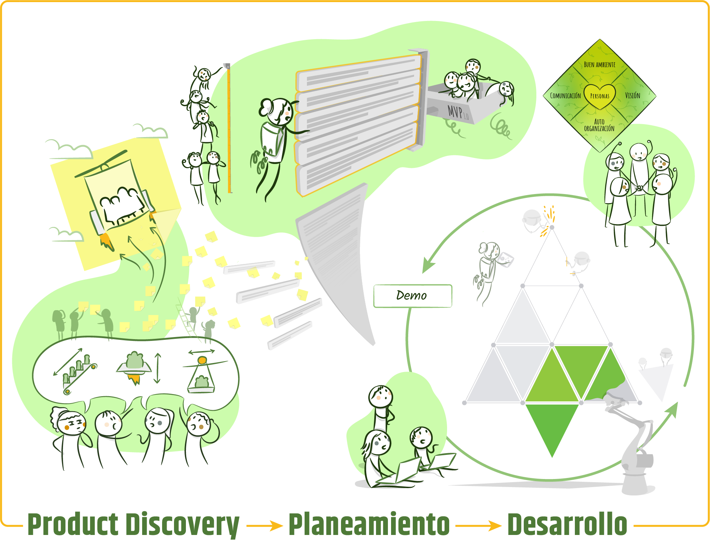

# Introducción

Todavía recuerdo mi reunión con Emilio Gutter, hasta ese momento un ex compañero de Globant y amigo de la comunidad Ágil, en la cual me invitó a ser parte de 10Pines. Me contó que habían fundado una empresa donde las personas y la calidad humana prevalecían y cuyo objetivo principal era generar valor haciendo lo que mejor sabíamos hacer: desarrollo de software ágil. La oferta fue muy tentadora: formar parte, desde los inicios, de una empresa concebida bajo los valores ágiles. ¡Eso sucedió hace 10 años y hoy sigo aquí!

Durante estos años, los pinos (quienes formamos parte de 10Pines) elaboramos nuestros procesos, seleccionamos herramientas y estandarizamos artefactos. En resumen, co-creamos nuestra Metodología[[1]](introduccion.md#notas-al-pie), que recientemente sentí la necesidad de observar con detenimiento, estudiar y describir. Este libro es el resultado de dicho proceso.

# Características Principales

Nuestra Metodología está basada en las personas, es liviana (enfocada en producir valor), se centra en la calidad y amplifica la comunicación. Les cuento con más detalle: 

**Basada en las personas**: Está pensada para que trabajemos felices, satisfechos y hagamos nuestra labor de la mejor manera posible. Nos valoramos por sobre cualquier proceso o herramienta. Creemos que, para el desarrollo de software, nada reemplazará a buenos desarrolladores interactuando efectivamente para crear una solución.

**Es liviana[[2]](introduccion.md#notas-al-pie), enfocada en la generación de valor**: Procuramos que nuestra actividad principal sea la programación, dejando los mecanismos de coordinación y control al mínimo. Queremos que sea tan liviana, como el problema a resolver lo permita. Suficiente con lo justo[[3]](introduccion.md#notas-al-pie). Que no le sobre nada, pero tampoco que le falte, porque esto sería contraproducente. En busca de este objetivo, continuamente procuramos eliminar el ‘desperdicio’[[4]](introduccion.md#notas-al-pie) de la cadena de valor, logrando una Metodología magra, donde cada una de las actividades ejecutadas y los artefactos creados contribuyan a agregar valor.

**Centrada en la calidad**: La calidad externa, definida por Weinberg como ‘valor para alguien’ es subjetiva y difícil de especificar. Por esto, nuestra Metodología busca acortar los ciclos de feedback, trabajando en incrementos pequeños que permitan generar conocimiento rápidamente. Sabemos también que la calidad interna, la excelencia técnica, resulta fundamental para lograr nuestro objetivo: ser capaces de generar valor sustentablemente, aún cuando el contexto cambie. Por todo esto, ‘horneamos la calidad desde el principio’[[5]](introduccion.md#notas-al-pie).

**Amplifica la comunicación**: es una Metodología que procura maximizar el ancho de banda en todas sus fases. Si establecemos un flujo de comunicación efectivo que incluya a todos los actores, tendremos más probabilidades de éxito. El involucramiento de nuestros clientes a través de una relación de colaboración es central en este sentido.

Quisiera que los lectores evalúen el cumplimiento de estos atributos en los procesos, herramientas y artefactos que describiré a lo largo de estas páginas.

# Flujo de Trabajo

El gráfico describe las diferentes fases que forman parte de nuestro proceso de desarrollo, juntamente con los artefactos principales generados en cada una de ellas:

Empezamos cada proyecto con una fase que llamamos [Product Discovery](product-discovery.md), donde procuramos entender los problemas y necesidades de los usuarios y esbozar una propuesta de valor. De este modo, creamos una visión compartida, nos alineamos y sentamos las bases de una relación de colaboración.

Refinamos nuestra visión escribiendo [*User Stories*](user-stories-and-backlog.md#user-stories), incrementos funcionales pequeños que almacenamos en orden de prioridad en el [Backlog](user-stories-and-backlog.md#el-backlog). Descomponer el trabajo de esta manera nos permite usar un proceso de desarrollo iterativo e incremental.

Realizamos una [estimación](estimaciones.md) superficial para obtener una noción del esfuerzo (y el costo consecuente), que usaremos para planificar el equipo y los tiempos. Las estimaciones tienen un grado de error y nunca representan un compromiso.

[Priorizamos](priorizacion.md) la construcción del producto para comenzar el desarrollo por lo que genere más valor y conocimiento (disminuyendo el riesgo). Lo importante es entender cuál es el Producto Mínimo Viable y cómo construirlo de la mejor manera.

Con toda esta información, [creamos un plan](planeamiento-agil.md) liviano, creíble y adaptable que iremos cambiando a medida que aprendamos.

[Conformamos un equipo](el-corazon-de-los-equipos-agiles-en-10pines.md), que trabajará en un buen ambiente, con una visión clara, auto-organizado y comunicándose de la manera más efectiva.

[Desarrollamos el software en incrementos](construyendo-el-producto-paso-a-paso.md#desarrollando-software-paso-a-paso) (las *User Stories* creadas), iterando sobre el conocimiento adquirido. Trabajar de esta manera nos permite incrementar nuestro conocimiento y poder adaptarnos, impactando en el valor generado.

[Desarrollamos enfocados en la excelencia técnica](desarrollando-software-con-excelencia-tecnica.md) desde el inicio. Mantenemos el costo de cambio bajo y pagamos la deuda técnica para incrementar nuestra funcionalidad sustentablemente y adaptarnos a los cambios externos. 

¡Los invito a continuar leyendo las páginas que siguen para entender profundamente el significado de trabajar y ser parte de nuestro mundo!

# Notas al Pie

1. ‘La Metodología es todo lo que haces regularmente en tu empresa para desarrollar software’. Incluye a quien contratas, para qué lo contratas, cómo trabajan, qué producen y cómo comparten. Entre los componentes de una metodología, podemos nombrar los *skills*, los roles definidos, las actividades en las que estos roles invierten su tiempo (programar, testear, reuniones), los procesos (cómo estas actividades encajan en el tiempo), los artefactos que producen, los *standards* que adoptaron y, por supuesto, los valores compartidos como grupo. [[Alistair00]](bibliografia.md#cockburn00-cockburn-alistair-agile-software-development-the-cooperative-game-2-nd-edition-octubre-2006)
2. El ‘**peso de la Metodología**’ está dado por la cantidad de ‘elementos de control’  necesarios (deliverables, *standards*, medidas de calidad) y la ‘ceremonia’ (cuánto se demora) de cada uno de ellos. [[Alistair00]](bibliografia.md#cockburn00-cockburn-alistair-agile-software-development-the-cooperative-game-2-nd-edition-octubre-2006)
3. Barely Sufficient [[Highsmith00]](bibliografia.md#highsmith00-highsmith-jim-agile-project-management-creating-innovative-products-agile-software-development-series-2nd-edition-julio-2009-1)
4. En el mundo de Lean, ‘desperdicio’ es toda actividad que no agregue valor, viendolo desde la perspectiva del usuario final.
5. Bake quality in [[Poppendieck00]](bibliografia#poppendieck00-poppendieck-00-mary-tom-lean-software-development-an-agile-toolkit-mayo-2003)