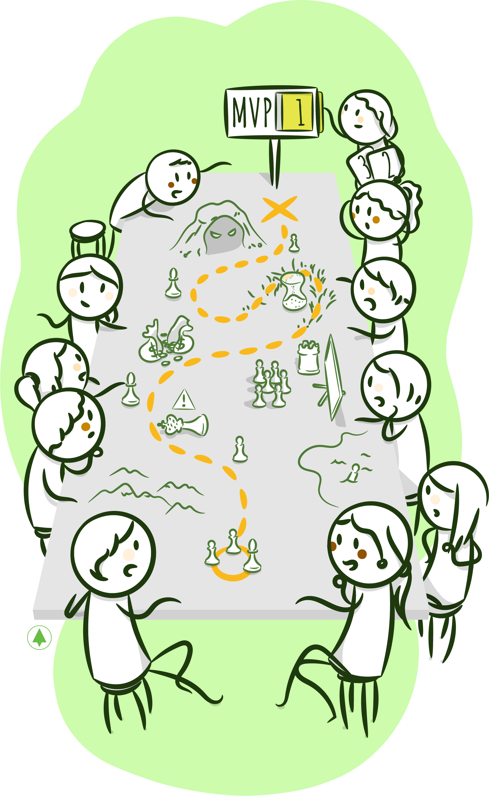
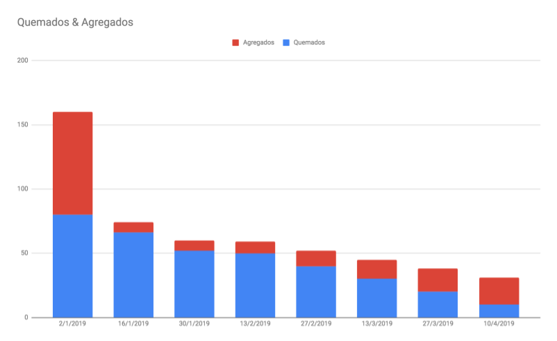
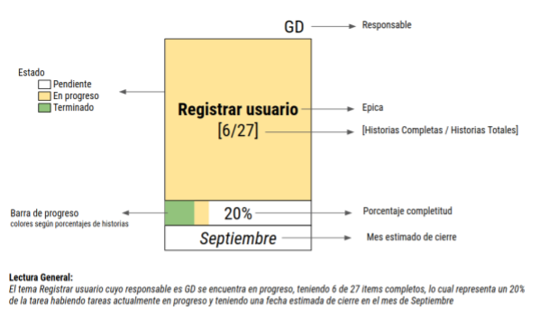
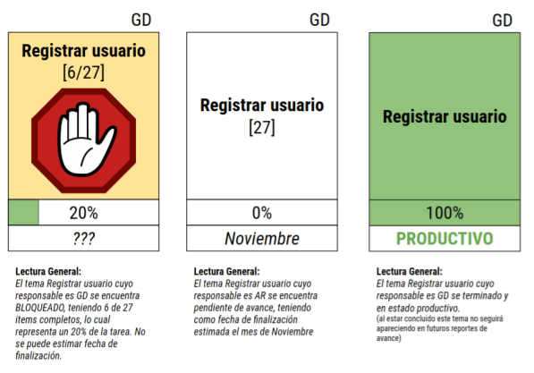
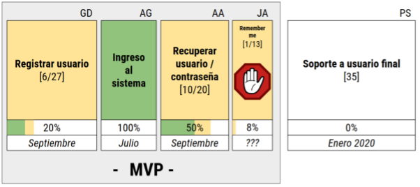

# **Planeamiento Continuo**

Ya hicimos el _Product Discovery_ y descubrimos qué se quiere construir y cómo brindará valor el producto. Entendemos mejor qué es lo más importante y también qué se considera indispensable para la primera versión. Escribimos las _User Stories_ y las estimamos. Tenemos una idea vaga, por supuesto, del tamaño. **Resta ahora pensar cuál es la mejor manera de construirlo, dadas las restricciones existentes**, que pueden ser de tiempo \(por ejemplo, ¿es necesario que el *MVP* esté en el mercado para cierta fecha?\) o de dinero \(los clientes cuentan con un presupuesto\).

Es momento para definir un plan, una primera versión de él, que esboce el camino para alcanzar nuestros objetivos. Retomando lo dicho por Marty Cagan: "para que un producto sea exitoso, debe ser **valioso, usable y factible de desarrollar**". Aquí debemos pensar la última parte: ¿Podemos construirlo en los tiempos necesarios y con los recursos con los que contamos? ¿Cómo lo haremos? ¿Qué tecnología usaremos? ¿Quiénes trabajarán en la construcción? ¿Por cuánto tiempo? ¿Cómo atacaremos los riesgos identificados? ¿Cuál será el costo? El plan representa una primera versión de las respuestas a todas estas preguntas y la visión conjunta necesaria, de todo el equipo, para alcanzar estos objetivos.

Un proyecto, según la definición de Johana Rothman en *Manage It!* [[_Rothman01_]](bibliografia.md#rothman01-rothman-johanna-manage-it-your-guide-to-modern-pragmatic-project-management-junio-2007): "es un esfuerzo novedoso para crear un nuevo producto o servicio, cuya entrega señala la finalización. Los proyectos implican riesgos y generalmente poseen recursos limitados". Tiene un _driver_ \(o un conjunto de _drivers_\), una duración específica, marcada por el momento en que se alcanzan los objetivos, y restricciones de tiempo/dinero que los _Project Managers_ deben gestionar. El plan define el curso de acción del mismo.

Haremos un plan para marcar el rumbo, pero no para seguirlo en detalle, ya que no es nuestro objetivo. Deseamos construir el mejor producto posible. En el libro "[_Planning eXtreme Programming_](http://www.informit.com/articles/article.aspx?p=26024)", Beck y Fowler [[Beck00]](bibliografia.md#beck00-beck-kent-fowler-martin-planning-extreme-programming-the-xp-series-octubre-2000) metaforizan los cambios necesarios durante la ejecución de un proyecto con las "constantes correcciones a realizar en el volante, cuando conducimos para mantener el recorrido". Nuestro plan se ajustará, ágilmente, con los cambios surgidos durante la construcción y, principalmente, con todo el aprendizaje que ésta dispare.

En este capítulo hablaremos sobre planeamiento: qué tienen nuestros planes y cuáles son sus características principales. Luego, evaluaremos en detalle las aristas principales englobadas en la gestión de un proyecto. A continuación, detallaré algunas herramientas que permiten visualizar el progreso del mismo. Finalmente, nos ocuparemos de algunas situaciones frecuentes que atentan contra los planes y su ejecución.

# **¿Qué Contiene un Plan?**

Componentes esenciales:

**La visión de negocios**: ¿A dónde queremos llegar? ¿Cuáles son los objetivos principales? Todos debemos compartirlos. En consecuencia, deben quedar claramente plasmados. Haberlos obtenido a través de las sesiones colaborativas del _product discovery_ simplifica esto enormemente.

**El Backlog**: el _Backlog_ inicial, que contiene _user stories_ sin mucho detalle. **Representa el entendimiento colectivo de cómo va a descomponerse el trabajo en incrementos de funcionalidad** que después nos permitan trabajar con un proceso de desarrollo iterativo e incremental. Podemos también tener identificadas las _User Stories_ que tienen que completarse para el MVP \(de hecho, lo mejor es que el plan corresponda a este grupo solamente\).

**El equipo**: definido en base a las tecnologías escogidas, al tamaño de lo que se quiere construir y a las restricciones de tiempo y dinero. **Será multidisciplinario**, es decir, contará con todos los _skills_ necesarios para hacer un incremento de funcionalidad y contará con **personas asignadas *full-time*** al proyecto.

**El** _**schedule**_ **inicial**: En base a las estimaciones realizadas y a la _Velocity_ prevista, se puede fijar un _schedule_ inicial. Podrían existir _deadlines_ fijados por el negocio \(por ejemplo, pensando en una presentación o en la competencia\). Estos deben figurar visibles en el plan, ya que deberemos ajustar otras aristas si la _Velocity_ no fuera la esperada.

**Consideraciones tecnológicas**: En el plan, incluimos la visión tecnológica del producto, es decir, el _stack_ de tecnología, las opciones para _hosting_, las herramientas principales, etc. 

## **Atributos**

Repasemos los atributos principales de nuestros planes:

* **Está basado en funcionalidades**: El atributo más importante. El plan es, en síntesis, un conjunto priorizado de funcionalidades. Está pensado para trabajar iterativa e incrementalmente. El progreso se irá midiendo en base a los incrementos finalizados.
* **Es un artefacto liviano**: Contiene un bosquejo del camino creado a partir de la información de la que disponemos hasta el momento. No se hace futurología ni se desperdicia tiempo en detalles que podrían ser decididos responsablemente más tarde. Hacer esto volvería el plan más pesado, quitaría tiempo para empezar a construir y daría una falsa sensación de seguridad.
* **Es fácil de cambiar**: Está pensado para "abrazar el cambio". Creamos el plan partiendo de la incertidumbre. Aprenderemos muchísimo durante el camino. Todo este nuevo conocimiento deberá plasmarse en el plan.
* **Es corto**: No creo en planes que duren muchos meses. 
* **Es creíble**: He visto _Project Managers_ crear planes con _deadlines_ y _milestones_, para luego transmitir al equipo el "cronograma". ¿Qué sentido tiene esto? ¿Podrías, como desarrollador, comprometerte con algo que no creaste y con lo que no crees? El plan debe ser producto de una visión conjunta consensuada.
* **Visible a todo el equipo**: Claramente, si fue creado y consensuado por todos, el plan es accesible a los integrantes en todo momento. ¿Podrías alcanzar las metas propuestas, si el equipo no dispone de toda la información?
* **No es un artefacto estático**: Este plan inicial, esbozado a partir del _Product Discovery_ y que contiene mucha incertidumbre aún, se refinará a medida que aprendamos: ¿Es factible tecnológicamente? ¿Podemos construir el producto a la _Velocity_ que habíamos estimado previamente? Este nuevo conocimiento, de negocios, tecnológico y del equipo, generado en la etapa de construcción, debe plasmarse en el plan, ya que sería una pena no usarlo a nuestro favor. Por las razones previamente mencionadas, Mike Cohn denominó a su libro "_Estimating & Planning_"[[Cohn00]](bibliografia.md#cohn00-cohn-mike-user-stories-applied-for-agile-software-development-marzo-2004). No es un plan. Es planeamiento, continuo. Y Jim Highsmith [[Highsmith00]](bibliografia.md#highsmith00-highsmith-jim-agile-project-management-creating-innovative-products-agile-software-development-series-2nd-edition-julio-2009) llamó a esta etapa "Especulación". Es un nombre muy acertado, ya que, en cualquier plan, existe incertidumbre. "Cuando especulamos, establecemos un objetivo y una dirección, pero, al mismo tiempo, esperamos cambios en el camino".

## **Aristas**

Hablemos por unos minutos como _project managers_, para entender las variables que llevan en sus cabezas cuando gestionan un proyecto. En este plan definimos 3 aristas:

* _**Scope**_: El alcance. Los planes ágiles se basan en un conjunto de funcionalidad priorizada.
* **Recursos**: Humanos y monetarios. Estas restricciones determinarán lo que podamos lograr.
* **Tiempos**: El calendario tentativo, incluyendo _milestones_ y _deadlines_, que deben ser tenidos en cuenta para alcanzar los objetivos.

Existe una 4ta arista, la de calidad, que no se especifica en el plan, sino que es el resultado de todos estos factores.

Estas aristas están vinculadas, unas con otras, en modos no lineales. Si una de ellas se modifica, alguna de las otras deberá modificarse también. Por ejemplo, cuando se descubre nueva funcionalidad \(_scope creep_, decían en mi época\), el proyecto implicará más tiempo. Podríamos intentar sumar "recursos" para aumentar la _Velocity_, pero los "recursos" son personas, que deben ser entrenadas, con el impacto consecuente sobre el proyecto \(como enunció Fred Brooks en su famosa [Ley de Brooks](https://en.wikipedia.org/wiki/Brooks's_law)). Si no quisiéramos correr la fecha y no sumáramos "recursos", la calidad seguramente se vería afectada.

En mis "años mozos", conocí el [Triángulo de Acero de la Gestión de Proyectos](https://en.wikipedia.org/wiki/Project_management_triangle), un modelo que permitía visualizar estas restricciones: si se "tira" de una de las aristas, alguna de las otras deberá moverse forzosamente.


En el libro de *Management* 3.0 [[Appelo00]](bibliografia.md#appelo00-appelo-jurgen-management-3-0-leading-agile-developers-developing-agile-leaders-diciembre-2010), Jurgen describe el Cuadrado de Acero, incluyendo en la 4ta arista la calidad.


La idea del cuadrado de acero es que la modificación de una de las aristas en una dirección tiene un efecto similar en alguna de las aristas adyacentes o el efecto contrario en la opuesta. Por ejemplo: ampliar la funcionalidad implica más recursos o extender la fecha o una calidad inferior \(interna y/o externa\). Una pérdida de recursos llevaría a tener que incluir menos funcionalidad, bajar la calidad o extender el tiempo.

El _Project Manager_ tiene como objetivo gestionar estas aristas para que el proyecto sea exitoso. La pregunta es: **¿Qué significa que el proyecto sea exitoso?** El Standish Group popularizó una métrica errónea, basándose en el cumplimiento de las aristas del triángulo de acero. Así, un proyecto resultaba exitoso en caso de completar el _scope_ planeado a tiempo y con los recursos estimados. Aprendí, a través de Jim Highsmith, que debemos tener en cuenta los factores de negocio al evaluar el resultado ¿Cuánto valor de negocio entregamos? ¿Resolvimos los problemas de los usuarios? ¿Es usable? Las decisiones que tomemos, durante la ejecución del proyecto, deben estar guiadas por estas preguntas. Nuestro objetivo debe ser la construcción de un producto que genere la mayor cantidad de valor de negocio y que sea usable, cumpliendo con las restricciones, es decir, dentro de los tiempos y el presupuesto con el que se cuenta. Con este objetivo en mente, el plan es otro artefacto que nos ayudará a ir decidiendo y visualizando cuál es la mejor manera de lograrlo.

Highsmith sugirió modificar el triángulo de acero para hacerlo compatible con los valores ágiles. Si el objetivo es maximizar el valor de negocio, este debía estar incluido en el triángulo:    


Como pueden ver, en una de las aristas se encuentra el valor, en forma de un producto implementable, la 2da equivale a la calidad interna, que permite al producto ser confiable y adaptable, y finalmente la 3ra, conformada por las restricciones \(costo, calendario y _scope_\).

Mike Cottmeyer escribió un [post](https://www.leadingagile.com/2010/01/replacing-the-iron-triangle-of-project-management/) en el que coincide en mover el foco de las restricciones al valor que el producto puede generar, pero no cree que el triángulo sugerido represente correctamente las relaciones entre las diferentes aristas, como sí lo hace el triángulo de acero. Sugiere incluir la calidad y el valor como parte del _scope_, es decir, de la _Definition of Done_. ¿Estaría algo terminado si el _Product Owner_ no aceptara su valor o si su calidad fuera pobre?


Personalmente, no logro visualizar las relaciones del triángulo original en ninguna de estas últimas variantes. Creo que entregar la funcionalidad imaginada, con la calidad esperada, es lo que permite generar el beneficio planeado. Si no cumplimos con el presupuesto, no podremos entregar nada. Y si no lo hacemos dentro de los tiempos esperados, otro lo hará. El valor de negocio es un _tradeoff_ complejo entre todas estas aristas y por eso no creo que pueda ser ubicado dentro de ellas.

Para finalizar, detallaré las heurísticas que sigo cuando gestiono un proyecto. El costo es una restricción fija, depende del presupuesto con el que contamos. No es una arista que se pueda modificar. Tampoco lo es la calidad interna. Creo que, en cualquier emprendimiento tecnológico, el _codebase_ debe mantenerse en buena forma, bien diseñado y testeado. De otra manera, no será ni confiable ni extendible. Restan el tiempo y la funcionalidad, aristas que iremos moviendo cual _sliders_, para obtener el mejor producto posible en tiempos razonables.

# **Midiendo la *Velocity* y Replaneando**

¿Cómo medimos el progreso del plan? Sabemos que, al esbozarlo, se efectuaron muchas especulaciones. Al empezar a desarrollar, habiendo priorizado las áreas con mayor valor e incertidumbre, aprenderemos del producto y del proyecto. Usaremos todo este conocimiento adquirido para "replanear". Esta es la base del planeamiento ágil: es continuo y se extiende a lo largo de todo el desarrollo del proyecto. No seguir un plan, sino ir descubriendo lo mejor para el producto y, en base a ésto, modificarlo.

Como ya vimos, todo el conocimiento ganado del producto lo reflejamos en el _Backlog_, donde re-priorizamos, agregamos y borramos _User Stories_. Veamos ahora algunas herramientas que sirven para visualizar el progreso.

## _**Burndown Chart**_

Este gráfico nos sirve para visualizar la pendiente de progreso del equipo, es decir, para determinar la cantidad de trabajo restante y, en base a la _Velocity_, estimar su finalización.

Simplemente graficamos una línea que represente la cantidad de puntos por "quemar". Esta cantidad está dada por la suma de los puntos de las _User Stories_ que restan por hacer. Cada vez que finalizamos una historia, "quemamos" sus puntos y actualizamos la pendiente. De esta manera, podemos calcular la pendiente y deducir la fecha de finalización estimada. Al momento de esbozar el plan, estimamos una pendiente \(y una fecha de finalización acorde\) que luego podremos contrastar con el progreso real.


Noten que, al graficar los _Story Points_ remanentes, no podemos distinguir los "quemados" de los agregados, es decir, los correspondientes a nuevas _user stories_. En otras palabras, si estuviéramos "quemando" menos puntos de los que estimamos, no podríamos, mediante este gráfico, discernir si esto se debe a una capacidad inferior del equipo a la estimada o al descubrimiento de nueva funcionalidad. Si quisiéramos presentar esta diferencia, podríamos hacerlo del siguiente modo:



Pueden existir muchas sutilezas en este juego de colaboración y comunicación que es el desarrollo de software. El gráfico podría mostrar que estamos "quemando" menos puntos de los planeados, pero esto puede deberse a que la funcionalidad no está claramente expresada en las _User Stories_ \(y, por ende, cuesta "aceptarlas"\). Estas herramientas disparan conversaciones que permiten clarificar razones y buscar mejoras progresivas.

## Parking Lot[[1]](planeamiento-agil.md#notas-al-pie) - por Gisela Decuzzi - Una forma de mostrar avance

Uno de los desafíos con los que me suelo encontrar en los proyectos en los que trabajo es la necesidad de comunicar el avance de las tareas y denotar qué tan cerca (o lejos) estamos de alcanzar nuestros objetivos. Esto puede parecer trivial. Sin embargo, al descomponer el trabajo en pequeñas historias, dependiendo de cómo nos organicemos, resulta difícil entender esta situación de un pantallazo. Muchas veces tenemos desarrolladas funcionalidades que a simple vista parecerían completas pero, por una cuestión de organización y prioridades de negocio, no lo están. 

Déjenme que cite un ejemplo, basado en un caso real. Nos encontrábamos realizando una migración del ingreso a un sistema existente. Descompusimos los temas en grandes secciones: Ingreso a la aplicación, registración de usuario (*sign-up*), recuperación de contraseña, bloqueo de usuarios, etc. Rápidamente generamos y tomamos las historias más importantes que le daban forma al desarrollo. Teníamos la sensación de que, tan solo a 2 *sprints* de haber empezado, ya habíamos terminado todo lo necesario. En realidad habíamos manejado sólo los casos principales, sin sumergirnos en profundidad. Por ejemplo, los usuarios podían registrarse sin ser verificada la seguridad de las *passwords* o ingresar al sistema sin permanecer logueados a partir de una sesión anterior o solicitar el reseteo de su contraseña con un pedido anterior aún vigente. Estos *features* para el negocio eran muy importantes, dado que representaban los diferenciales sobre el sistema de ingreso existente. Sin embargo, como los usuarios de negocio no estaban en el día a día, terminaba explicandoles una y otra (y otra) qué funcionalidad nos faltaba. Lo cierto es que no teníamos buena visibilidad del estado de avance del proyecto.

Prefiero no invertir demasiado tiempo en la generación de reportes complejos costosos de mantener o dependientes de una persona. **Una buena herramienta de reporte es aquella que, de un pantallazo, comunica información compleja de forma entendible para el que la recibe**. Esto era lo que buscaba. Algunos colegas me sugirieron un reporte llamado *Parking Lot*.

Antes de entrar en detalle acerca de cómo lo implementamos en varios proyectos, permítanme destacar algunas características de los proyectos donde este reporte fue de gran utilidad: 

- Agrupación en grandes temas: en particular mapear *épicas* y descomponerlas en historias pero al comunicar siempre hacer referencia a las épicas.
- Tamaño: cada gran tema tiene su complejidad y su tamaño consecuente, que uno pretende comunicar al exterior. Estimamos cada historia usando *Story Points* y el tamaño de una épica lo consideramos simplemente como la suma de los puntos de sus historias.
- Avance: al comunicar, simplificar el ciclo de vida de las historias en pasos sencillos: *Pendiente, En Progreso, Terminado* con hitos claros de cuando se cambia de un estado a otro. Podrían existir más estados intermedios (por ejemplo en revisión, en testing, rechazado, etc.) pero, fuera del equipo de desarrollo, no se requiere tanta granularidad dado que lleva a confusiones.
- Tema bloqueado: cuando nos encontramos con dependencias no resolubles por el equipo de desarrollo, y necesitamos de alguien más para destrabar este tema, resulta información valiosa para comunicar hacia fuera del equipo.

La idea del *Parking Lot* es usar la metáfora un estacionamiento, organizado por sectores para distintos tipos de vehículos. Con esta inspiración, dimensionamos los temas en tamaños relativos, usando rectángulos más grandes mientras mayor esfuerzo se requiera.

Recomiendo utilizar las épicas como grandes temas, dimensionados mediante la sumatoria de los puntos de cada historia que lo conforma, para con esas proporciones formar rectángulos más amplios. Si notamos que varias épicas componen una agrupación que tiene sentido comunicar (por lo general nos pasa), simplemente encerramos los temas en un rectángulo.

Cada uno de los rectángulos que representa un gran tema queremos que comunique:

1. **Estado**: para esto podemos usar una convención de colores, por ejemplo:
   1. **Blanco**: Pendiente
   2. **Naranja**: En progreso
   3. **Verde**: Terminada
2. **Avance**: hace referencia a su nivel de completitud usar un porcentaje de la épica e indicarlo con una barra de progreso (similar al medidor de batería de los celulares).
3. **Descripción** del tema: indicar en pocas palabras a qué nos estamos refiriendo, el nombre de la épica.

Opcionalmente se puede agregar información relevante para el proyecto, como por ejemplo:

1. Indicador de bloqueo en un tema.
2. Fecha estimada (a grandes rasgos, puede ser por ejemplo un mes) de completitud de la épica.
3. El responsable de cada tema.

En la siguiente imagen podemos ver un ejemplo de aplicación:



Ejemplos en distintos estados:



Si aplicáramos esto a todo el proyecto, obtendríamos un gráfico similar a:



# **_Planning Failure Modes_**

## **Un Plan Detallado para lidiar con la Complejidad**

Muchos _Project Managers_ que conocí procuraban manejar la complejidad inherente a un proyecto de desarrollo de software mediante un plan detallado que buscaba adelantarse a todas las posibles circunstancias. Esto brindaba una falsa sensación de seguridad: ¿qué podría salir mal con tal nivel de planificación?

Prefiero seguir los valores ágiles para manejar la complejidad: presentar toda la información de modo visible y transparente, para que, junto al equipo, decidamos el curso de acción a medida que el proyecto progresa. La evaluación es constante y se refleja en el plan, que va mutando para alcanzar los objetivos propuestos.

## _**Multitasking**_

Este es un _failure mode_ típico de grandes corporaciones: planear como si fuéramos a trabajar en un solo proyecto, pero hacerlo en varios, además de sumar reuniones y otras actividades. El impacto en cada proyecto y en la productividad es inmenso y suele pasar desapercibido[[2]](planeamiento-agil.md#notas-al-pie).

¿Conocen la [Ley de Little](https://berriprocess.com/es/2016/01/03/la-ley-de-little/)? Dice que si estamos haciendo X tareas a la vez, demoraremos X veces más en terminar cada una de ellas. Bastante fuerte, ¿no? Visualicemos la fórmula mediante un ejemplo: imaginen que tienen un negocio y son capaces de atender 2 personas por hora \(_Throughput_\). Asumiendo que dedican media hora \(0.5 horas\) para cada una \(_Leadtime_\), según la ley mencionada, la cantidad promedio de personas en el local \(_wip_\) será 1.

```
=> throughput * leadtime = wip
```

Con nuestros datos:

```
=> 2 * 0.5 = 1
```

Despejando el _lead time_, podemos ver que:

```
=> leadtime = wip/throughput
```

Esto implica que si en vez de atender 1 persona atendiésemos 2 simultáneamente, el tiempo para terminar con cada una de ellas será de 1 hora y no 30 minutos. Noten que el tiempo para completar las 2 tareas implica lo mismo, es decir, 1 hora, por lo que no se perdió productividad. Sin embargo, cada uno de las tareas demora el doble.

```text
1 tarea a la vez => 1/2= 0.5 hr
2 tareas a la vez => 2/2 = 1 hora
```

Para hacer estos cálculos, asumimos que podemos _switchear_ de tarea sin ningún _overhead_ \(como las computadoras\). Para las personas, estos cambios no son gratuitos lo que, en consecuencia, repercutirá en el tiempo de cada uno.

### _**Flow**_

Siempre me produjo mucha molestia la interrupción en el "momento del codeo", ya que me resulta difícil alcanzar una concentración adecuada: entender el problema e imaginar el diseño para, finalmente, empezar a escribir código. Este proceso no ocurre de un momento a otro. Sin embargo, no fue hasta la lectura de *Peopleware* [[DeMarco00]](bibliografia.md#demarco-demarco-tom-peopleware-productive-projects-and-teams-febrero-1999), cuando supe de un estado, llamado "_flow_" por los psicólogos, que implica una condición de concentración y meditación extrema, donde se pierde la noción del tiempo y el esfuerzo. Juan Pablo, un desarrollador y músico que trabaja en 10Pines, lo explicó de este modo: "Ciertas actividades necesitan de un gran impulso inicial, un esfuerzo equiparable con el despegue. Mientras se avanza en dicho estado mental, se gana altura. Una vez arriba, mantenerlo no cuesta tanto esfuerzo. Sin embargo, una interrupción implica el reinicio del proceso". Muy posiblemente, trabajos ligados al desarrollo o a la música necesiten de este estado. Existen otros roles, como el de _Project Manager_, que desempeñan múltiples actividades pequeñas y casi simultáneas, para quienes alcanzar este estado no resulta necesario.

Piensen entonces las consecuencias que implicará _staffear_ a un desarrollador en más de un proyecto: cada uno de ellos demorará más y los integrantes no tendrán los tiempos necesarios para alcanzar el _flow_, además del _overhead_ que se producirá por cada uno.

## _**Deadlines**_ **Estrictos**

¿Les resulta familiar este diálogo?

* _Project Manager_: Tenemos que terminar este proyecto para el 21 de Julio.
* Desarrollador: ¿Ya está definido el alcance?
* _Project Manager_: Todavía no.
* Desarrollador: ...

Yo lo escuché en muchas ocasiones; ¿les parece razonable?

De similar modo, nos encontramos frecuentemente con _Project Managers_ que sostienen fechas irrealizables, buscando forzar la productividad del equipo. Así, los integrantes trabajarán más horas, resignando tiempo personal. En general, estas personas suelen ser muy convincentes, logrando que el equipo se sacrifique para después sufrir grandes problemas de calidad o la renuncia de integrantes, extenuados por el ritmo de trabajo. No creo que este tipo de motivación obtenga buenos resultados. "Con esta presión los desarrolladores no trabajan 'mejor', trabajan más rápido".

Creo en la visibilidad, la transparencia y la honestidad para fijar una fecha y medir el progreso. Creo que todo el equipo debe estar al tanto de las razones de un _deadline_ de haberlo. Además, debe creer que es factible alcanzarlo mediante un ritmo sustentable. No tengo miedo de caer bajo la [Ley de Parkinson](https://explore.easyprojects.net/blog/parkinsons-law-the-secret-to-project-management-success). En equipos donde existe confianza y colaboración, las tareas que terminan antes, simplemente terminan antes. Toda esta información se refleja claramente en nuestro plan, en todo momento.

# **Conclusiones**

Tener un plan no significa otra cosa que saber adónde se quiere llegar y tener trazada una ruta hacia dicho punto. Cuando comenzamos, nos encontramos frente a una gran incertidumbre. Delineamos un plan liviano, que nos permite aprender rápidamente. Comenzamos a trabajar enfocados en agregar valor y reducir el riesgo, incorporando el conocimiento adquirido en nuestro plan.

Muchas veces escuché decir que en _Agile_ no se planea. ¿Tiene sentido pensar en que se puede empezar a trabajar sin un mínimo de descubrimiento y planeamiento? Creo que no. El punto es cuánto resulta razonable y eficiente. En otras palabras, cuánto invertiremos en hacerlo: ¡No pierdan el tiempo adivinando!

Finalmente, recuerden que el plan es simplemente otro de los artefactos que nos ayuda a entregar un producto con valor. Nuestro objetivo no es seguirlo.


# Notas al Pie

2. https://leadinganswers.typepad.com/leading_answers/2007/02/summarizing_pro.html
2. Si buscan un juego para visualizar el costo del multitasking, les recomiendo [The Multitasking Name Game](https://www.crisp.se/gratis-material-och-guider/multitasking-name-game) de Henrik Kniberg.

