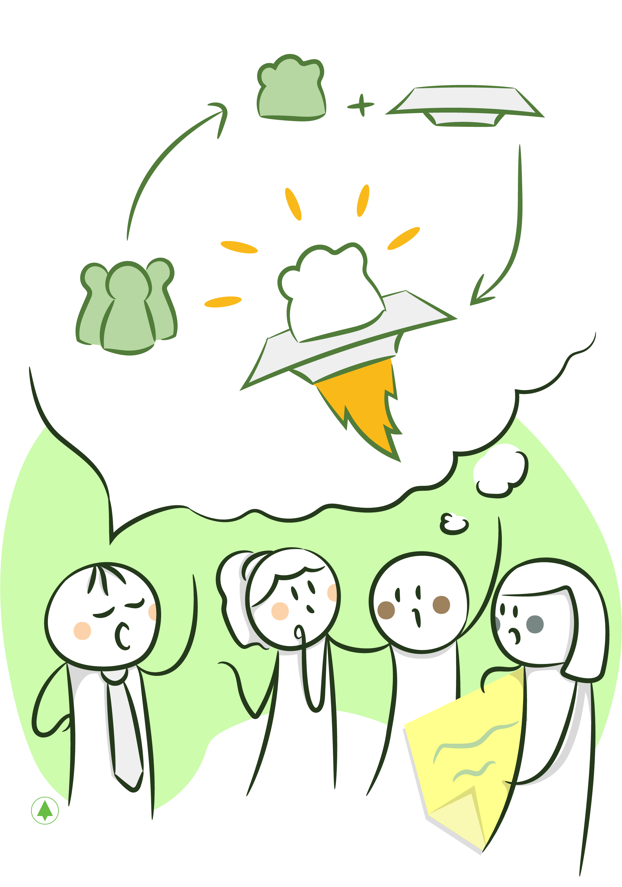

# ***User Stories & Backlog***

Ya terminamos la fase de _Product Discovery_, que nos permitió tener una visión compartida acerca de lo que deseamos construir y por qué, quiénes serán los usuarios principales y cuál será el modelo de negocios. Ahora, debemos refinar nuestro entendimiento de la funcionalidad detectada, descomponiéndola en ítems o incrementos de funcionalidad que usaremos primero para planear y luego para construir el producto incrementalmente, con el involucramiento cercano de los _Product Owners_.

Kent Beck bautizó estos incrementos de funcionalidad con el nombre de _User Stories_ o historias de usuario. El proceso que imaginó, y plasmó en la Metodología _Extreme Programming_, implicaba que los usuarios pensaran la funcionalidad, la escribieran en una tarjeta, desencadenando esto el relato de la ‘historia’ del usuario. Noten que lo importante de todo esto no es la tarjeta, sino la conversación que esta provoca entre usuarios y desarrolladores para refinar el entendimiento de la funcionalidad.

Por una cuestión de organización y gestión, ‘planchamos’ las _User Stories_ descubiertas en una lista priorizada \(que luego estimaremos\) llamada _Product Backlog_. Considero este artefacto esencial para realizar el planeamiento y luego para gestionar el progreso, aunque sé, como contrapartida, que se pierde la visión completa del producto.

En este capítulo ahondaré sobre estas herramientas, describiendo sus características principales, cómo las creamos y cómo las usamos.

# _**User Stories**_

## **Un Poco de Historia**

Durante los años 90, Kent Beck \(quizás, la persona más influyente en el nacimiento del mundo de desarrollo ágil\) sugirió que la manera que usábamos para especificar el producto a desarrollar era tremendamente ineficiente. ¿Qué hacíamos? Una parte del equipo, conformado generalmente por los analistas, intentaba describir mediante un documento, en la fase de Análisis del Proceso del Desarrollo en Cascada, todo lo que el sistema a desarrollar debía contener. Luego, este documento era entregado a los desarrolladores para que empezaran a trabajar a partir de él. ¿Difícil, no? Difícil especificar lo que se tiene que hacer en un documento, que este sea completo y entender qué hacer a partir del mismo. Beck propuso un cambio radical, paradigmático y revolucionario desde la simplicidad: **que los usuarios de negocio escribieran una tarjeta por cada una de las funcionalidades que deseaban ver en el sistema** y que dicha tarjeta operase como el disparador de un **conjunto de conversaciones que sirvieran para clarificar qué se deseaba** o, en otras palabras, para hacer el análisis.

Ron Jeffries capturó los componentes de las _User Stories_ en la famosa fórmula de las 3C’s, en inglés: _Card_, _Conversation_ & _Confirmation_ \(en español, sería TCC por Tarjeta\):

* Una tarjeta, tangible, que representa una funcionalidad.
* Una conversación que se da entre todos los integrantes del equipo, clientes, usuarios, desarrolladores, testers, etc.
* La confirmación, formal, que los objetivos han sido alcanzados.

Así nacieron lo que hoy llamamos _User Stories_, que detallaré en las secciones que siguen. Sin embargo, nunca olviden que estas toman su nombre a partir de cómo deben ser empleadas: **justamente para contar historias.**

## **Atributos de las *User Stories***

Antes de contarles cómo escribir _User Stories_, les voy a contar algo que considero más importante: cuáles son los atributos que estas deben poseer. En un rapto de honestidad brutal, les diré que si tienen estos atributos, poco me importa si usan el formato clásico de escritura de *User Stories*.

Las _User Stories_ **deben estar escritas en el lenguaje de los usuarios finales**, **deben explicar el qué** \(por sobre el cómo\), **deben contener alguna funcionalidad visible al** _**Product Owner**_ y **deben ser gestionables**.

Profundizo en cada una de estos atributos:

**Escritas en el lenguaje del usuario final**: ¿Queremos entender el dominio que estamos modelando? Entonces ¿qué mejor que describir cada una de estas funcionalidades empleando la jerga de estos usuarios en sus tareas diarias? Esto nos forzará a tener las conversaciones necesarias para entender, en profundidad, cada uno de los conceptos que estamos modelando. Por ejemplo, si estamos construyendo un software para un cajero de un supermercado, deberemos entender cómo denominan a cada uno de los productos, qué significa un arqueo de la caja y cualquier otro concepto que forme parte de su área de competencia.

**Deben explicar el qué**: Es importante en este momento que se ponga el foco en describir qué es lo que se quiere construir por sobre el cómo. Esta característica se vuelve fundamental en los casos en que las *User Stories* sean escritas sin el aporte del equipo de desarrollo. *Product Owners*: No prescindan de un aporte tan fundamental como el del área técnica para el diseño de una solución, porque se perderían de una perspectiva fundamental. Desarrolladores: Si las _User Stories_ ya describen la solución, vuelvan un paso atrás y pregunten qué se quiere lograr. Mantengan su cabeza abierta para evaluar otras alternativas.

**Contener Alguna Funcionalidad Visible al** _**Product Owner**_: Debe implicar una vista nueva, algún mensaje que reciba \(basado en un conjunto de condiciones\), el envío de un email, etc. Esta característica es fundamental, teniendo en cuenta que emplearemos un proceso de desarrollo iterativo e incremental donde el _Product Owner_ estará involucrado. Hacer incrementos de funcionalidad pequeños para obtener *feedback* lo más rápido posible es clave. Por supuesto que, para lograr esto, cada funcionalidad que desarrollemos incluirá trabajo en cada una de las capas que formen parte del _stack_ de tecnología que hayamos elegido \(por ejemplo, en una arquitectura clásica contendrá funcionalidad de la vista, el modelo y la base de datos\).

**Gestionables**: Queremos ‘partir’ el trabajo en ítems relativamente pequeños, para entenderlos mejor y para reducir la incertidumbre. El tamaño de estos ítems es bastante subjetivo, ya que depende del equipo, las tecnologías y de la duración de la iteración. Para dar una idea, prefiero _User Stories_ que puedan terminarse en un lapso comprendido entre 2 y 5 días. Hacer cosas más pequeñas representa demasiado _overhead_ administrativo. Hacer cosas más grandes resulta peor aún, ya que el *feedback* se hace demasiado lento y puede no haber sensación de progreso. El equipo técnico es quien mejor conoce el esfuerzo requerido para desarrollar una _User Story_ y es el que deberá aconsejar partirla si esta fuese demasiado grande.

## **Escribiendo *User Stories***

 Ya sabemos que las _User Stories_ sirven para contar historias. También enumeramos sus atributos más importantes. Ahora describiré el formato clásico para escribirlas. Sin embargo, no quiero que lo incorporen como una regla que no pueden romper. En mi opinión, ustedes deben buscar el mejor modo de escribirlas en su contexto particular, siempre cumpliendo con los atributos que les mencioné.

El formato clásico para las *User Stories* es:

```text
Como <un rol>
Deseo <hacer algo>
Para <obtener algún valor>
```


Por ejemplo, siguiendo con nuestro cajero:

```text
Como cajero
Deseo ingresar un producto manualmente
Para seguir con la compra en los casos en que el scanner no funcione
```

Este es el *template* clásico de escritura de _User Stories_. Noten que está descrita desde la perspectiva de uno de los usuarios finales y constituye alguna funcionalidad a emplear. Escribirlas de este modo nos asegura que lo desarrollado será algo visible.

La 3ra sentencia, que explica el valor, tiene como objetivo que los usuarios expliquen por qué necesitan esa funcionalidad. En mi experiencia, muchas veces se hace difícil o un poco inútil explicar la razón de una funcionalidad tan pequeña. Creo que uno explica el porqué de módulos grandes de funcionalidad y no el de sus partes.

Esta breve descripción servirá para tener una idea, superficial, de la funcionalidad esperada, aunque probablemente no contenga todos los detalles necesarios para que el equipo pueda empezar a construirla. Tenemos que ampliar la descripción. Para tal fin, usaremos los '**criterios de aceptación**', que **son descripciones adicionales, ejemplos de uso, reglas que se deben cumplir o incluso** _**mocks**_ **de las pantallas**. Cualquier información que ayude a entender la funcionalidad, en el mejor formato \(el más claro\), ‘suma’ dentro de los criterios de aceptación.

Para agregar un ejemplo, podemos usar este *template*, tan conocido para los desarrolladores que hacen tests automatizados:

```text
Given (dado)
When (cuando)
Then (entonces)
```

Es decir, dado un conjunto de precondiciones, cuando ejecutamos cierta acción, deberíamos ver cierto resultado. Escribir los criterios de aceptación de esta manera permite traducirlos en tests automatizados, que pasarán a constituir ‘documentación viva’ \(como lo denominó Gojko Adzik [[Adzic00]](bibliografia.md#adzic00-adzic-gojko-specification-by-example-how-successful-teams-deliver-the-right-software-1st-edition-junio-2011)).

Por ejemplo, si quisiera dar un criterio de aceptación que describa qué pasa con el cálculo de todos los ítems, podría especificarlo así:

```text
Dado que la suma de mis ítems es 100
Y el costo de la manteca es 20
Cuando ingreso manualmente el código de la manteca
Entonces la suma de mis ítems será 120
```

A veces, en vez de utilizar un ejemplo, podemos especificar una regla, que nos permita entender qué hacer en cualquier situación. Imaginen que el supermercado aplica un descuento del 10% en la compra de 3 productos iguales.

El criterio de aceptación podría ser una regla escrita del siguiente modo:

```text
Si escaneo o ingreso 3 ítems iguales => aplico 10% sobre esos productos
```

Así, el costo de 3 mantecas será 3\*20 - 6 = $54

Otras veces, los criterios de aceptación no corresponden a ninguna de estas características o simplemente es mejor describirlos de otro modo. Si tuviera que especificar la funcionalidad para emitir un recibo, que consiste en enviar un conjunto de información a un controlador fiscal, la _User Story_ consecuente podría plasmarse del siguiente modo:

```text
Como cajero
Deseo emitir un recibo fiscal
```

Y dentro de los criterios de aceptación, debería especificar todos los datos que enviaré:

* Total
* IVA
* Descuentos

Un punto muy importante, cuando escriban los criterios de aceptación, es que **todo debería ser lo más concreto posible**, desplazarse de la subjetividad. No pueden especificar que algo debe ser rápido o debe verse bien. ¿Qué implica que algo sea rápido? ¿Qué implica que se vea bien? Todo esto debe estar claramente definido.

Cuando estamos construyendo una aplicación que tiene una interfase visual \(una _app web_ o _mobile_\), la mayoría de las _User Stories_ tendrán asociadas una vista en la que se desarrollará esta funcionalidad. El mejor modo para describirla es a través de un _mockup_, que podría ser dibujado a mano \(muchas veces lo hemos realizado junto con el usuario y luego fotografiado) o ser confeccionado en una herramienta que sirva para este fin como [balsamiq](https://balsamiq.com/). Dentro de estos _mockups_ podemos agregar cualquier descripción que sirva para refinar el *scope* de la funcionalidad a describir. Retomando el ejemplo del recibo de la _User Story_ anterior, podríamos haberlo imaginado en un _mockup_, como el de la imagen que sigue, donde especificamos la información esperada de un modo más visual:    
****


Este _mockup_, precario \(porque lo hice yo\), tiene toda la información de los criterios mostrados en el ejemplo anterior, de modo más prolijo y con las aclaraciones pertinentes que hacen a la _User Story_ mucho más comprensible. Una imagen vale más que mil palabras. Utilicen esto a su favor.

Por supuesto que **las** _**User Stories**_ **no tienen que ser la única herramienta de documentación/especificación disponible**. A continuación detallo otras que me han resultado muy útiles:

_**Workflow**_ **de estados**: En muchas herramientas que he construido, hemos necesitado describir un _workflow_ de estados para algunas de las entidades que modelamos. Hacerlo a través de las _User Stories_ no hubiera tenido sentido. Es mucho mejor describirlo a través de un gráfico, que contenga los diferentes estados y sus transiciones.

**Flujo de Navegación de Pantallas**: podríamos decir que se trata de un caso particular del anterior. Para visualizar la navegación entre las diferentes vistas, lo que hemos hecho es imprimir las pantallas \(una en cada hoja\) para luego vincularlas con flechas, describiendo las situaciones que causan los cambios de pantalla \(Balsamiq permite crear una aplicación para navegar entre las diferentes vistas y testear la usabilidad del producto de modo realista\).

Estos son ejemplos de herramientas adicionales que usamos para pensar y describir la funcionalidad que deseamos construir y que luego podremos vincular desde las _User Stories_.

Un punto muy importante que quiero mencionarles: como en el caso del código, la duplicación es mala ('La raíz de todos los males en el software', dice ‘Uncle Bob’ [[1]](user-stories-and-backlog.md#notas-al-pie)). Si tuviéramos especificaciones duplicadas, tendríamos una carga mayor de trabajo para mantenerlas actualizadas y correríamos adicionalmente el riesgo de no entender cuál es la última versión.

Me gustaría cerrar esta sección diciéndoles que, como en cualquier otra parte de su Metodología, en la escritura de las *User Stories* **deben ser críticos para refinar el proceso **y encontrar el modo más claro y eficiente.     
****

## **Proceso de Descubrimiento**


Paso a contarles cuál es el proceso de descubrimiento y refinamiento de las _User Stories_. El resultado del _Product Discovery_ nos brinda los artefactos que nos sirven como base. En particular, el _User Story Mapping_ es muy útil. Partiendo de las tareas que cada uno de los roles ‘hace’ en el sistema, inferimos la funcionalidad necesaria para escribirlas. Ya vimos el caso donde, para la tarea de escaneo manual que habíamos detectado, creamos una _User Story_ para detallarla con mayor profundidad. También habíamos descubierto que el cajero podía tomar un 'pago con tarjeta de crédito'. Seguramente, será mejor construir una funcionalidad tan compleja usando múltiples _User Stories_, de manera de poder incluir al _Product Owner_ durante la construcción y medir el progreso intermedio.

En este trabajo de descubrimiento inicial, en el que vamos identificando las _User Stories_ e incluyéndolas en un _Backlog_ inicial \(artefacto del que hablaré en breve\), no debemos preocuparnos por entender su _scope_ exacto, ya que iremos refinándolas a medida que avancemos en la construcción del producto. El objetivo no es comenzar el desarrollo inmediatamente, sino armar un _Backlog_ que describa la funcionalidad más importante, priorizarlo y hacer una estimación que sea usada, posteriormente, al efectuar la planificación del proyecto.    
****

## ***Example Mapping***


Descubrí esta técnica en la conferencia XP 2016 y la he usado en un par de ocasiones para escribir _User Stories_ junto a todo el equipo. Su creador es Matt Wynn. Pueden obtener más información [aquí](https://cucumber.io/blog/2015/12/08/example-mapping-introduction).

La idea de esta herramienta consiste en estructurar la conversación que se da al intentar escribirlas, partiendo de la base de que todas tienen un título, un conjunto de reglas, un conjunto de ejemplos que ayudan a clarificar esas reglas y un conjunto de preguntas abiertas. Utilizamos tarjetas de diferentes colores para cada uno de estos componentes:

* Título: amarillas
* Regla: azules
* Ejemplos: verdes
* Preguntas: rojas

Por cada _User Story_ se construirá un ‘mapa’ usando estas tarjetas, como muestra la imagen que sigue:


Noten que los colores tienen el objetivo de poder visualizar ciertos _smells_ en las _stories_:

* Muchas tarjetas rojas nos dicen que aún tenemos mucho que aprender.
* Muchas tarjetas azules nos dicen que es grande y complicada y quizás convenga partirla.
* Muchas tarjetas verdes para una regla nos dicen que quizás se trate de más de una.

En las ocasiones en las que facilité esta actividad, me resultó útil bosquejar las pantallas en las cuales sucedían estas funcionalidades. Creo que una tarjeta para poder hacer esto sería una buena adición a la herramienta.

Esta técnica sirve para depurar las _User Stories_ de una manera estructurada y efectiva. Si lo hace todo el equipo, repartiéndoselas y luego presentándolas, la actividad puede ser muy enriquecedora.

## **Partiendo** _***User Stories***_

Muchos equipos que comienzan a trabajar con User Stories encuentran incómodo trabajar en *slices* verticales tan pequeños. Suelen decirme vehementemente que tenga en cuenta que involucra trabajo en todas las capas, que no es eficiente trabajar así. Puede llegar a sonar ineficiente, pero puedo convencerlos de lo contrario. Es posible trabajar en incrementos pequeños de funcionalidad eficientemente, usando buenas prácticas de desarrollo de software, como _Test Driven Development_ y _Continuous Refactor_.

Lo que tenemos por ganar es mucho:

* Recibir el _feedback_ de los usuarios del negocio rápidamente.
* Medir el progreso del proyecto en base a funcionalidad terminada.
* Hacer _releases_ pequeños.

Podemos tener en cuenta estas maneras de ‘partir’ las *stories* cuando nos parezcan demasiado grandes:

* **Partir usando agrupaciones lógicas**: Por ejemplo, si incluyera el alta de una persona y de sus datos de facturación, podríamos crear una para el alta de la persona y otra para el alta de sus datos de facturación.
* **Separar el manejo de las condiciones excepcionales**: Escribir una para el ‘camino feliz’ \(sin tener en cuenta las condiciones de error\) y otra para manejar los casos que puedan fallar.
* **Separar las distintas operaciones**: Por ejemplo, hacer una para cada operación de un ABM.
* **Separar desde la GUI**: Es decir, hacer una que contenga la funcionalidad, sin los detalles de diseño, y otra que contemple el diseño.
* **Hacer un** _**spike**_: Cuando existe demasiada incertidumbre \(y digo demasiada, porque siempre debemos resolver algo\), podemos hacer un _Spike_ que sirva para investigar y posteriormente la _User Story_ para hacer el trabajo propiamente dicho.

# **El** _***Backlog***_


Cuando empezamos a construir el _Backlog_, nos focalizamos en descubrir todo el trabajo que tenemos por delante, sin ir a los detalles, haciendo un barrido horizontal de todo el producto y procurando identificar toda su funcionalidad. Hacemos en este momento también un trabajo importante de priorización: ¿Cuáles son las _User Stories_ que forman el _core_? ¿Qué es lo más importante para el negocio? ¿Qué es lo más riesgoso? ¿Cuáles son las _User Stories_ que debemos construir para edificar la arquitectura de la aplicación?

Las _User Stories_ del _Backlog_ inicial no están refinadas, es decir, no está escrito el detalle de cada una de ellas. Antes de empezar, de la primera iteración, debemos tener un conjunto de _User Stories_ mínimo que habilite un flujo continuo de trabajo del equipo de desarrollo. Este proceso de refinamiento se realiza empezando por el tope del Backlog, por las _User Stories_ prioritarias. ¿Cuántas refinar? No existe un máximo estipulado, pero tengan en cuenta que no deseamos refinarlas si no estamos seguros de ‘consumirlas’ luego.

El _Backlog_ no es un artefacto estático, es un artefacto que muta en el transcurso del proyecto. Se modifica para reflejar, en todo momento, nuestro entendimiento del producto en proceso de construcción..

Todo el equipo trabaja activamente en el _Backlog_, pero es el _Product Owner_, la persona que mejor conoce el negocio, quien debe encargarse de gestionarlo de modo prolijo. Él procura que las _User Stories_ estén bien escritas y de priorizarlas. Muchas veces, a partir de conversaciones mantenidas entre los miembros del equipo o de _feedback_ externo, pueden surgir cambios en funcionalidad que inicialmente se había pensado, que deben reflejarse prolijamente en el _Backlog_ a través del _Product Owner_.    
****

## **¿Qué es el** _***Backlog***_ **de Producto?**


Formalizando, el _Backlog_ es una lista priorizada y posiblemente estimada de las *User Stories* del proyecto. Lo utilizamos para almacenar, comunicar, compartir y principalmente gestionar todo el conocimiento que adquirimos durante el transcurso del proyecto, a través de las _User Stories_. Es, además, una herramienta de gestión fundamental durante la construcción del sistema que nos permite visualizar qué _User Stories_ fueron terminadas, están en desarrollo o quedan por hacer.

## **Atributos Importantes**


Repasemos los atributos más importantes de este artefacto:

**Es un artefacto ‘vivo’**: Su vida comienza en la fase de descubrimiento y planeamiento del _release_ con un conjunto de _User Stories_, de las que se posee información superficial. Durante la fase de construcción, cada una de estas se refinará, es decir, se profundizará el conocimiento del _scope_ hasta contener toda la información necesaria para comenzar a desarrollar. Además, seguramente se descubrirán otras, ya que es imposible detectar toda la funcionalidad de un producto en un momento inicial. Nuestra cabeza no funciona así. Necesita retroalimentación. Observar funcionalidad dispara nuevas ideas, que deben ser plasmadas en nuevas _User Stories_. También es posible que otras resulten modificadas, repriorizadas o incluso eliminadas. El trabajo en el _Backlog_ se extiende durante el transcurso del proyecto.

**Contiene ítems con niveles de refinamiento diferentes**: Es decir, con diferentes niveles de entendimiento. Encontraremos _User Stories_ cuyo *scope* esté completamente definido y otras que serán simplemente ideas. También encontraremos algunas pequeñas, estimables, y otras de gran tamaño, comúnmente llamadas épicas, conviviendo dentro del mismo _Backlog_.

**Es liviano**: Es muy fácil agregar, modificar, borrar y priorizar _User Stories_. Tiene que serlo, ya que el trabajo que se hará sobre él será intensivo.

## **Herramientas Digitales**

Creo que es fundamental contar con una herramienta digital para la correcta gestión del _Backlog_, tanto para su conformación como para la posterior administración del proyecto.

En 10Pines trabajamos con clientes que utilizan diferentes herramientas como [Jira](https://www.atlassian.com/software/jira), [VersionOne](https://www.versionone.com/) o [Pivotal Tracker](https://www.pivotaltracker.com/). Otros clientes tienen su propia herramienta ágil que se adapta exactamente a su metodología, como *[8thlight](https://8thlight.com/)* con [Artisan](https://artisan.8thlight.com).


Mi herramienta preferida es Jira porque permite visualizar claramente el _Backlog_, las _User Stories_ y los _story boards_. Además, el _workflow_ es configurable y soporta Scrum y Kanban. Como desventaja, contiene demasiada información en cada vista, lo que dificulta ubicar lo realmente necesario.

# **Conclusiones**

Descomponemos el trabajo en un conjunto de incrementos funcionales pequeños y visibles al _Product Owner_, para poder involucrarlo en el desarrollo y brindar _feedback_ tempranamente. Hacer los incrementos pequeños permite reducir la incertidumbre y medir el progreso frecuentemente. Llamamos a estos incrementos _User Stories_. Conversar con los usuarios para que nos ‘cuenten’ sus historias resulta esencial. La información procedente de este intercambio no puede compararse con ninguna otra escrita.

Usamos un _Backlog_ para gestionar las *User Stories* y para facilitar las conversaciones. Se trata de un artefacto ‘vivo’, que el equipo consultará y modificará durante el transcurso del proyecto.


# Notas al Pie

1. '*The root of all evils in software in software design*' - [Martin00](bibliografia.md#martin00-martin-uncle-robert-clean-code-a-handbook-of-agile-software-craftsmanship-agosto-2008)

